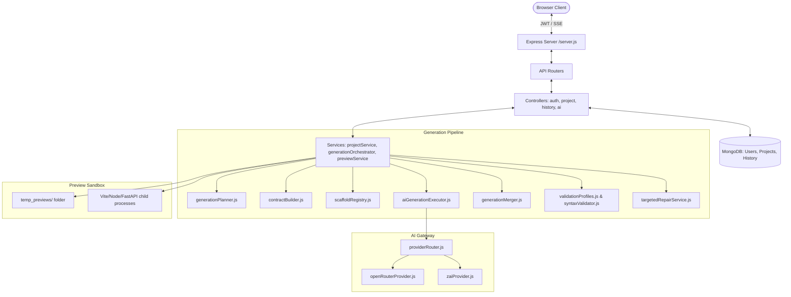
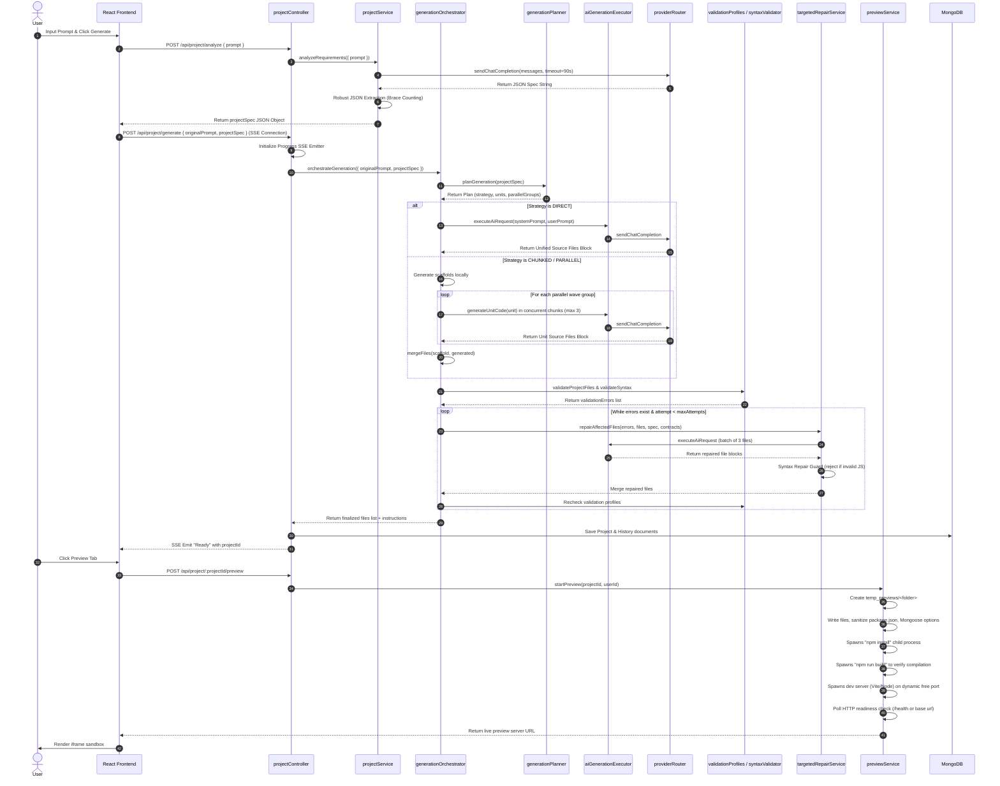
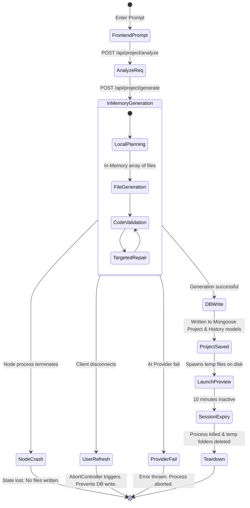
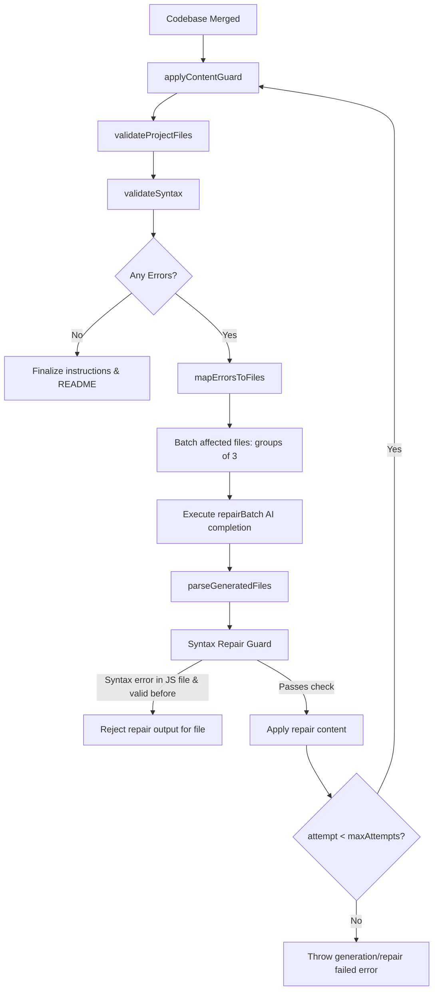

# Z.ai Local Coding Assistant — Read-Only Architecture Discovery Report

This report provides a comprehensive, read-only analysis of the architecture of the **Simple AI Website Builder / Z.ai Local Coding Assistant** repository. It contains codebase evidence, traces flows, catalogs behaviors, lists metrics, maps dependencies, and provides recommendations for the next architecture.

---

## A. Executive Architecture Summary

The **Z.ai Local Coding Assistant** is a developer tool that bridges natural language prompts and locally testable web projects. It acts as an autonomous software agent by:
1. Translating a prompt into a structured specification JSON.
2. Generating a local, stack-specific scaffold.
3. Spawning concurrent modular AI calls to write implementation files.
4. Performing multi-phase syntax and completeness validation.
5. Invoking targeted AI repair loops to fix errors.
6. Launching live preview servers within a secure host sandbox.
7. Packaging the project into downloadable ZIP archives.

All data, including code files and specs, are stored in MongoDB. The current backend implementation uses a wave-based scheduling model that supports multiple stacks (MERN, React-Vite, Next.js, Express, FastAPI, Vanilla, and Dynamic Fallback).

---

## B. Current Architecture Diagram



---

## C. Current E2E Execution Sequence Diagram



---

## D. AI Provider Call-Path Diagram

```mermaid
graph TD
    A[aiGenerationExecutor: executeAiRequest] --> B[calculateAdaptiveTimeout]
    A --> C[providerRouter: sendChatCompletionDirect]
    
    subgraph providerRouter.js
        C --> D{getPrimaryProvider}
        D -->|openrouter| E[openRouterProvider: sendChatCompletion]
        D -->|zai| F[zaiProvider: sendChatCompletion]
        
        E -->|Rate Limit / Timeout / 5xx / nullContent| G{getFallbackProvider}
        F -->|Rate Limit / Timeout / 5xx / nullContent| H{getFallbackProvider}
        
        G -->|zai| I[zaiProvider: sendChatCompletionDirect]
        H -->|openrouter| J[openRouterProvider: sendChatCompletionDirect]
        
        I -->|Fallback Failure & Transient| K[Backoff loop: Max 3 retries]
        J -->|Fallback Failure & Transient| L[Backoff loop: Max 3 retries]
    end
    
    subgraph aiGenerationExecutor.js (Outer Retries)
        A --> M{executeWithBackoff: Max 3 Retries}
        M -->|Transient or nullContent| A
    end
```

---

## E. Persistence / Recovery Diagram



---

## F. Verification / Repair Flow Diagram



---

## G. Module Dependency Map

The 20 most architecture-critical modules of the Z.ai Local Coding Assistant:

| # | Module / Path | Responsibilities | Depends On | Called By | State Owned | Side Effects | Unit Tests | Migration Risk |
|---|---|---|---|---|---|---|---|---|
| 1 | [server.js](file:///c:/Users/LENOVO/OneDrive/Desktop/z.AI/backend/server.js) | Entry point, DB connection, HTTP Server initialization | db.js, route modules | Node system | Server handles | Listens on port | No | Low |
| 2 | [projectController.js](file:///c:/Users/LENOVO/OneDrive/Desktop/z.AI/backend/controllers/projectController.js) | Maps express requests to projectService, generationOrchestrator, previewService | projectService, generationOrchestrator, previewService, Project, History models | Router | SSE connection state | Saves docs to MongoDB, writes SSE streams | Yes (mocked) | Moderate |
| 3 | [projectService.js](file:///c:/Users/LENOVO/OneDrive/Desktop/z.AI/backend/services/projectService.js) | Requirements analysis prompt generation, validation wrapper | providerRouter, generationOrchestrator | projectController | None | External AI calls | No | Moderate |
| 4 | [generationOrchestrator.js](file:///c:/Users/LENOVO/OneDrive/Desktop/z.AI/backend/services/generationOrchestrator.js) | Controls the scaffold/generation/repair pipeline | generationPlanner, scaffoldRegistry, contractBuilder, aiGenerationExecutor, targetedRepairService, validationProfiles | projectController, projectService | None | Logs execution summary to console | Yes (mocked) | High (God Module) |
| 5 | [generationPlanner.js](file:///c:/Users/LENOVO/OneDrive/Desktop/z.AI/backend/services/generationPlanner.js) | Strategies, tokens, units, parallelGroups planner | stackProfiles | generationOrchestrator | None | None | Yes | High |
| 6 | [contractBuilder.js](file:///c:/Users/LENOVO/OneDrive/Desktop/z.AI/backend/services/contractBuilder.js) | Builds shared contracts folder structures and manifest | stackProfiles | generationOrchestrator | None | None | Yes | Moderate |
| 7 | [scaffoldRegistry.js](file:///c:/Users/LENOVO/OneDrive/Desktop/z.AI/backend/services/scaffoldRegistry.js) | local scaffold directory seeding | stackProfiles | generationOrchestrator | None | None | Yes | Low |
| 8 | [stackProfiles.js](file:///c:/Users/LENOVO/OneDrive/Desktop/z.AI/backend/services/stackProfiles.js) | Contains stack definitions (MERN, Vite, Next, FastAPI) | None | contractBuilder, scaffoldRegistry, generationPlanner, previewService | None | None | Yes | High |
| 9 | [aiGenerationExecutor.js](file:///c:/Users/LENOVO/OneDrive/Desktop/z.AI/backend/services/aiGenerationExecutor.js) | Sends prompts, parses blocks, retries & timeouts calculator | providerRouter | generationOrchestrator, targetedRepairService | None | External AI calls | Yes | High |
| 10 | [generationMerger.js](file:///c:/Users/LENOVO/OneDrive/Desktop/z.AI/backend/services/generationMerger.js) | Combines scaffold and generated array lists | None | generationOrchestrator | None | None | No | Low |
| 11 | [validationProfiles.js](file:///c:/Users/LENOVO/OneDrive/Desktop/z.AI/backend/services/validationProfiles.js) | Evaluates file lists, json structures, external deps, imports | contractBuilder, stackProfiles | generationOrchestrator, previewService | None | None | Yes | High |
| 12 | [targetedRepairService.js](file:///c:/Users/LENOVO/OneDrive/Desktop/z.AI/backend/services/targetedRepairService.js) | Maps errors to files and launches repair batches | aiGenerationExecutor, syntaxValidator | generationOrchestrator | None | External AI calls | Yes | High |
| 13 | [syntaxValidator.js](file:///c:/Users/LENOVO/OneDrive/Desktop/z.AI/backend/utils/syntaxValidator.js) | Runs Babel parse to verify syntax of JS/JSX | @babel/parser | generationOrchestrator, targetedRepairService, previewService | None | None | Yes | Moderate |
| 14 | [previewService.js](file:///c:/Users/LENOVO/OneDrive/Desktop/z.AI/backend/services/previewService.js) | Setup temporary workspace, spawn npm install/build/run | Project model, stackProfiles | projectController | activePreviews Map | Writes to filesystem, spawns processes, listens on ports | Yes (mocked) | High (God Module) |
| 15 | [providerRouter.js](file:///c:/Users/LENOVO/OneDrive/Desktop/z.AI/backend/services/aiProviders/providerRouter.js) | Resolves primary/fallback endpoints and manages failovers | zaiProvider, openRouterProvider | projectService, aiService, aiGenerationExecutor | None | External AI calls | No | Moderate |
| 16 | [openRouterProvider.js](file:///c:/Users/LENOVO/OneDrive/Desktop/z.AI/backend/services/aiProviders/openRouterProvider.js) | OpenRouter axios call client | None | providerRouter | None | External HTTP call | No | Low |
| 17 | [zaiProvider.js](file:///c:/Users/LENOVO/OneDrive/Desktop/z.AI/backend/services/aiProviders/zaiProvider.js) | Z.ai axios call client | None | providerRouter | None | External HTTP call | No | Low |
| 18 | [Project.js](file:///c:/Users/LENOVO/OneDrive/Desktop/z.AI/backend/models/Project.js) | Schema definitions for projects | mongoose | projectController, previewService | mongoose model | MongoDB queries | No | Low |
| 19 | [History.js](file:///c:/Users/LENOVO/OneDrive/Desktop/z.AI/backend/models/History.js) | Schema definitions for prompt history | mongoose | projectController | mongoose model | MongoDB queries | No | Low |
| 20 | [User.js](file:///c:/Users/LENOVO/OneDrive/Desktop/z.AI/backend/models/User.js) | Schema definitions for users | mongoose | authController | mongoose model | MongoDB queries | No | Low |

---

## H. Architecture Gap Matrix

This table lists architectural gaps in the current implementation that prevent scaling up to support arbitrary technologies and larger codebases, mapped to proposed boundary replacements:

| Current Architecture Feature / Gap | Architectural Constraint / Problem | Proposed Boundary Replacement |
|---|---|---|
| Monolithic requirements prompt | Simple system prompt relies entirely on AI to structure requirements. No conflict detection or stable ID tracking. | `RequirementCompiler` (generates ProjectSpec AST) & `RequirementValidator` |
| Heuristic execution planner (`generationPlanner.js`) | Fixed conditions and stack checks. High risk of task block failure without ability to retry individual tasks. | `TaskPlanner` & `TaskGraph` (DAG scheduler with topology sort) |
| Unified in-memory generation array | Entire codebase is held in memory and written at the very end. Process crash resets the whole pipeline. | `FileOperationsEngine` (Virtual VFS) & `CheckpointStore` (granular MongoDB snapshot write) |
| Dumb, flat context dumping | The entire codebase file list and shared contracts are sent in every AI prompt. bloats token consumption on large codebases. | `ContextBuilder` (assembles only imported files / subgraph files using import parsing) |
| Hardcoded MERN/stack references | Hardcoded tech profiles in `previewService.js` (ports proxying, env writes, build steps) and `stackProfiles.js`. | `StackAdapter` abstraction framework (seeding commands and adapters out of config files) |
| Unstructured, monolithic repair | Batches up to 3 files together with error lists. If repair succeeds in file A but fails/breaks file B, it restarts. | `RepairEngine` (targeted single-file repair engine with transactional rollbacks) |
| Process-direct Live Preview | Launches raw `npm run dev` child processes directly on the host machine using random ports. | Isolated sandboxing or containerized endpoint orchestration |

---

## I. Reuse / Wrap / Refactor / Replace Matrix

Recommendations for each architecture-critical subsystem:

| Subsystem | Classification | Rationale | Migration Dependency | Migration Risk | Smallest Safe Incremental Change |
|---|---|---|---|---|---|
| **Provider layer** | REFACTOR | `providerRouter.js` and `aiGenerationExecutor.js` work well but have duplicate timeout/retry logic. Refactor into `AIProviderGateway`. | None | Low | Merge the two provider calling wrapper blocks into a unified gateway class. |
| **Requirement analysis** | REFACTOR | The balanced brace parsing is solid. Wrap it inside a `RequirementCompiler` and validate specs using JSON schemas. | None | Low | Add a schema validator checker to `projectService.analyzeRequirements`. |
| **Planning** | REPLACE | Heuristics fail to plan complex graphs. Implement `TaskPlanner` returning a topological `TaskGraph`. | Requirement analysis | Moderate | Let `generationPlanner` return a formal task map representing files instead of custom wave arrays. |
| **Generation engine** | REFACTOR | Modularize execution units so they are decoupled from the stack profiles structure. | Planning | Moderate | Move MERN-specific units logic to a stack profile provider. |
| **Context management**| REPLACE | Context size scales quadratically with project files. Context builder must resolve file-dependency imports. | File operations | High | Parse relative imports of files under generation to only include dependent code blocks in prompt context. |
| **File operations** | REPLACE | Moving from memory array to transactional VFS enables checkpoints and atomic file mutations. | Persistence | High | Create a `VirtualFileSystem` class to wrap the generated files array in `generationOrchestrator.js`. |
| **Sandbox** | REFACTOR | Process spawning and port management are complex. Decouple them from the file extraction blocks. | None | Moderate | Create a preview runner wrapper class in `previewService.js`. |
| **Verification** | REFACTOR | Make verification checks pluggable and modular instead of monolithic inline checks. | None | Low | Create a `VerificationEngine` with registered checkers (`SyntaxChecker`, `DependencyChecker`). |
| **Repair** | REPLACE | Batch-repair of 3 files is token-heavy. Move to transactional single-file repair loops. | Verification | Moderate | Modify the repair batch caller to repair and verify one file at a time. |
| **Preview** | WRAP | Continue using `previewService.js` but wrap it under a unified `PreviewAdapter` boundary. | Sandbox | Low | Define a `PreviewAdapter` interface. |
| **Persistence** | REPLACE | Single MongoDB Project document limits crash recovery. Break down into Tasks, Versions, and Files tables. | File operations | High | Create a MongoDB schema for `Checkpoints` and intermediate generation states. |
| **Stack support** | REPLACE | Decouple stack profiles from hardcoded node/MERN logic. Create plugin-based configuration profiles. | None | Moderate | Convert `stackProfiles.js` into JSON configuration adapters. |
| **Artifact packaging** | KEEP | `adm-zip` works perfectly. | None | Low | Keep as is. |
| **Tests** | REFACTOR | Extend unit testing to cover the actual AI providers (using mocks) and requirement parser. | None | Low | Add mocks for OpenRouter/Z.ai in the test runner. |

---

## J. Large-Project Bottleneck Analysis

Using a large-scale project reference workload (e.g. LearnSphere LMS: courses, lectures, quizzes, profiles, payments, dashboards, instructor portals, analytics):

*   **Major Generation Waves / Phases**:
    Under the MERN `CHUNKED` strategy, the planner schedules **6 execution waves** (backend_foundation $\rightarrow$ backend_api $\rightarrow$ frontend_shell $\rightarrow$ frontend_pages $\rightarrow$ frontend_components $\rightarrow$ documentation). These are completely sequential, meaning that any lag in a wave halts the entire pipeline.
*   **Likely AI Call Count**:
    1 (analysis) + 6 (module generation) + 5 to 15 (repair calls due to the high volume of components and routes). Total AI call count is estimated at **12 to 22 calls** per complete generation.
*   **Sequential Bottlenecks**:
    All 6 generation phases are sequential. In addition, targeted repairs are processed in sequential batches of 3, meaning that lint errors are fixed slowly, slowing down completion.
*   **Context-Growth Bottlenecks**:
    As the codebase grows (e.g., 40+ React views and schemas for LearnSphere), the `contracts` object sent in the prompt context grows excessively. The repair loop also passes complete files in the prompt. This will hit the 4000-token prompt budget, causing code truncation or incomplete implementations.
*   **Provider Timeout Risks**:
    Large generations easily exceed the 90s-240s adaptive timeouts when dealing with high token volumes, causing fake timeout failures and failovers.
*   **File-Conflict Risks**:
    Since chunks generate components in isolation, there is a high risk that `mergeFiles` overwrites files or imports become broken if they are not generated under absolute contract paths.
*   **Verification Cost**:
    Running `npm install` and `npm run build` on a complex stack inside the temporary preview sandbox can take 3 to 5 minutes, easily hitting the preview timeout bounds.
*   **Repair Amplification Risks**:
    Fixing an import error in File A might break File B, which causes a new validation error. In a large project, this leads to repair oscillation, exhausting the 2-attempt limit and failing the entire build.
*   **Crash-Recovery Weakness**:
    If the server crashes on wave 5, all 4 generated waves are lost from memory. There is no resume checkpoint.
*   **Requirement-Loss Risks**:
    Without stable requirement IDs, the AI agent in the repair loop might delete complex page logic to fix a React compile error, leading to a successful build that is missing the actual requested features.

---

## K. Minimum-Time Migration Recommendation

### Smallest Architecture Change for Reliability
The single most effective and minimal change is **Checkpoint Persistence**. 
*   **Action**: Instead of keeping files in memory during the orchestrator loop, save the intermediate file list to MongoDB (e.g., in a `Project.draftFiles` field or a temporary state model) after each successful generation unit wave.
*   **Why**: If the process crashes or times out, the backend can retrieve the draft state and resume the orchestrator at the next incomplete wave, saving up to 80% of generation time and avoiding double-billing/wasting tokens.

### Top 3 reliability improvements per implementation effort:
1.  **Intermediate Checkpoint Saving**: Persists the files list after every generation wave. (Effort: Low, Impact: High)
2.  **Syntax & Import Self-Repair Guard**: Validate code syntax using `@babel/parser` *before* files are merged, reverting to the previous state immediately if the AI returns broken syntax. (Effort: Low, Impact: High)
3.  **Sub-graph Context Truncation**: Only pass the files/contracts that are directly imported by the current generation unit. (Effort: Moderate, Impact: High)

### Postponable Architecture Changes:
*   Containerized preview sandboxes (can continue using localized `temp_previews` folders).
*   Full AST compilation of user prompts.

---

## L. Ordered Migration Phases

### Phase 1: VFS, Checkpoint Store & Gateway Refactor (Weeks 1-2)
*   **Dependencies**: None
*   **Deliverables**:
    *   Implement `AIProviderGateway` consolidating provider failovers.
    *   Introduce `VirtualFileSystem` to manage file writes in memory.
    *   Add a checkpoint collection in MongoDB. Save files list after each generation wave.

### Phase 2: Pluggable Verification & Transactional Repairs (Weeks 3-4)
*   **Dependencies**: Phase 1
*   **Deliverables**:
    *   Decouple validation checks into `VerificationEngine`.
    *   Rewrite `targetedRepairService` to perform single-file repairs with rollbacks if the repair introduces a syntax or import error.

### Phase 3: DAG Scheduler & Sub-graph Context Builder (Weeks 5-6)
*   **Dependencies**: Phase 2
*   **Deliverables**:
    *   Implement `TaskPlanner` and a true topological `TaskGraph`.
    *   Introduce `ContextBuilder` that builds prompts containing only imports-relevant contracts/files.

---

## M. Top 10 Risks

1.  **Context Exhaustion**: Large projects (LearnSphere) exceeding model token ceilings during repair.
2.  **Repair Loops**: Oscillating import errors where fixing one breaks another.
3.  **Windows File Locking**: EPERM errors when deleting preview folders, leading to disk bloat.
4.  **Preview Timeout**: Package installations taking longer than the allotted 120s–240s preview limit.
5.  **Data Inconsistency**: overwriting active code files if two concurrent tasks write to the same path.
6.  **Safety Failures**: Models refusing to generate code due to safety filters, triggering unnecessary provider failovers.
7.  **Real Secret Leaks**: AI accidentally generating valid API keys in `.env.example`.
8.  **Port Collisions**: `getFreePort` race conditions if two previews launch at the exact same millisecond.
9.  **Stale Checkpoints**: Resuming a project generation using stale requirement specs.
10. **State Corruption**: If MongoDB crashes mid-write, leaving orphaned preview processes running.

---

## N. Top 10 Unanswered Questions Requiring Runtime Experiments

1.  **Vite Port Re-routing**: Can we intercept hot-reload events to route websockets through the dashboard proxy?
2.  **GLM Reasoning Limits**: Does Z.ai's reasoning model require system prompt tweaks to prevent reasoning token budget exhaustion?
3.  **Windows Process Tree Termination**: Does killing Vite on Windows leave orphaned node/esbuild processes?
4.  **Parallel package.json Installations**: Does running concurrent `npm install` inside the same parent environment cause package conflicts?
5.  **Repair Batch Size**: Is a batch size of 1 file more reliable and token-efficient than a batch of 3 files?
6.  **Babel Parsing Limits**: Does `@babel/parser` support advanced CSS-in-JS or custom file extensions safely?
7.  **Dynamic Stack Adapters**: Can we configure a stack (like Ruby on Rails) entirely from JSON schema without compiling JS routes?
8.  **Context Window Slicing**: What is the optimal number of lines of file history to send for repair?
9.  **Concurrent MongoDB Writes**: Does high client concurrency degrade SSE generation streams?
10. **Sandbox Port Hijacking**: Can preview servers bind to public interfaces instead of `127.0.0.1`?

---

## O. Recommended Phase 1 Scope

We recommend focusing Phase 1 on the following high-priority, low-risk enhancements:
1.  **AIProviderGateway Consolidation**: Move openRouter client and zai client under a single interface.
2.  **Checkpoint Store Implementation**: Save the generation state after every unit wave. Add a `/resume` endpoint.
3.  **VirtualFileSystem Integration**: Abstract file lists inside a VFS class to manage imports validation and paths safety check before writing.

This ensures immediately higher generation success rates with a clear rollback capability.
