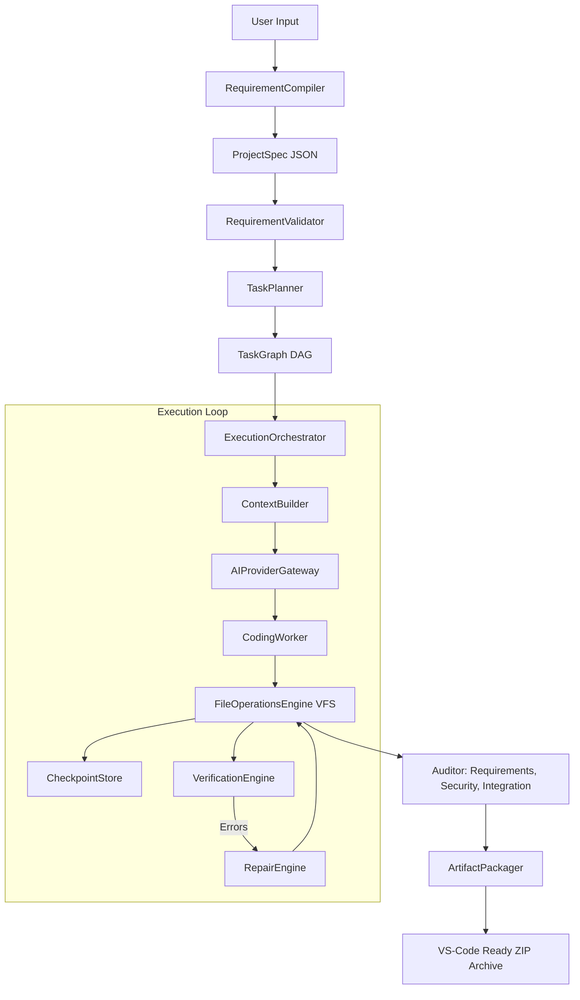

# Z.ai Application Builder — Target Architecture Document

This document defines the target architectural direction for the evolution of the Z.ai Local Coding Assistant into a generic, high-reliability AI application builder.

## 1. Mission and System Goals
The evolved builder is designed to scale from simple portfolios to complex full-stack products (such as LearnSphere, an LMS platform) while maintaining strict correctness.

**Key Objectives:**
- **Prompt Sizing Agnosticism**: Support both single-line descriptions and extremely large requirement prompts.
- **Robust Code Integrity**: Prevent AI code emission with stubs, ellipsis placeholders, or broken imports.
- **Durable Progress**: Survive mid-process server crashes, client refreshes, or rate limits via wave checkpoints.
- **Evidence-Based Qualification**: Transition from blind code generation to audited builds, syntax parsing, and integration tests.
- **Extensible Stacks**: Support arbitrary frameworks (MERN, React-Vite, Next.js, Express, FastAPI, Django, etc.) via pluggable profiles.

---

## 2. Current vs. Target Evolution
The migration moves from a monolithic, in-memory wave execution pipeline to a decoupled, graph-driven execution loop backed by a transactional virtual file system and checkpoints.

```
[CURRENT MONOLITHIC FLOW]
Prompt -> analyzeRequirements (AI) -> planGeneration (Heuristics) -> In-Memory Scaffold & Merging -> validationProfiles & targetedRepair (Monolithic) -> Project.create (Save at the end)

[TARGET MODULAR BOUNDARIES FLOW]
Prompt -> RequirementCompiler -> ProjectSpec (AST) -> RequirementValidator -> TaskPlanner -> TaskGraph (DAG) -> ExecutionOrchestrator -> VFS & CheckpointStore -> Code generation & Verification Gates -> Auditor -> Packaging
```

---

## 3. High-Level Architecture Diagram



---

## 4. Core Component Specifications

### 4.1 RequirementCompiler
- **Responsibility**: Translates raw prompts into structured specification JSON models.
- **Input**: Natural language prompt (string).
- **Output**: `ProjectSpec` specification model.
- **Existing Module Mapping**: Refactors [projectService.js:analyzeRequirements](file:///c:/Users/LENOVO/OneDrive/Desktop/z.AI/backend/services/projectService.js#L9).

### 4.2 ProjectSpec
- **Responsibility**: The canonical, validated structural data model of the application. It acts as a persistence-independent canonical domain contract. MongoDB/Mongoose models are persistence representations, not the canonical ProjectSpec definition.
- **Input/Output**: JSON Schema defining routes, schemas, APIs, auth, styling, and dependencies.
- **Consumer Tracing**: Consume by future validation, RTM, contracts, TaskGraph planning, ContextBuilder, verification, audits, and persistence adapters.
- **Requirement Identity**: Requirement identity is assigned deterministically by application code, not trusted to LLM output.
- **Existing Module Mapping**: Formalizes the schema currently used in [projectService.js](file:///c:/Users/LENOVO/OneDrive/Desktop/z.AI/backend/services/projectService.js).

### 4.3 RequirementValidator
- **Responsibility**: Inspects ProjectSpec completeness and checks for missing or conflicting parameters.
- **Input**: `ProjectSpec`.
- **Output**: Validation errors list or success boolean.
- **Existing Module Mapping**: [NEW] Introduced to prevent starting generation on malformed specifications.

### 4.4 RTM-Lite (Requirements Traceability Matrix)
- **Responsibility**: Maps Requirement IDs to files, contracts, and validation checks.
- **Input**: ProjectSpec + file targets.
- **Output**: Mapping indexes.
- **Existing Module Mapping**: [NEW] Added for tracing code generation correctness back to the prompt.

### 4.5 ContractGenerator
- **Responsibility**: Generates interface contracts (API routes, mongoose schemas, file trees) before code generation begins.
- **Input**: `ProjectSpec`.
- **Output**: JSON folder/route manifests.
- **Existing Module Mapping**: Refactors [contractBuilder.js](file:///c:/Users/LENOVO/OneDrive/Desktop/z.AI/backend/services/contractBuilder.js).

### 4.6 TaskPlanner
- **Responsibility**: Compiles the `ProjectSpec` and contracts into a dependency-ordered list of tasks.
- **Input**: `ProjectSpec` + Contracts.
- **Output**: List of Tasks with explicit dependency links.
- **Existing Module Mapping**: Refactors [generationPlanner.js](file:///c:/Users/LENOVO/OneDrive/Desktop/z.AI/backend/services/generationPlanner.js).

### 4.7 TaskGraph
- **Responsibility**: The DAG scheduler that maintains task execution waves, nodes, and statuses.
- **Input**: List of Tasks.
- **Output**: Topological waves schedule.
- **Existing Module Mapping**: [NEW] Extends the simple dependency arrays.

### 4.8 ExecutionOrchestrator
- **Responsibility**: Coordinates parallel and sequential task execution and saves states.
- **Input**: `TaskGraph`.
- **Output**: Final codebase.
- **Existing Module Mapping**: Replaces [generationOrchestrator.js](file:///c:/Users/LENOVO/OneDrive/Desktop/z.AI/backend/services/generationOrchestrator.js).

### 4.9 ContextBuilder
- **Responsibility**: Builds minimal context sizes by resolving the import subgraph of files.
- **Input**: Target Task + VFS state.
- **Output**: Prompt context string.
- **Existing Module Mapping**: [NEW] Prevents sending the entire project file list in every call.

### 4.10 AIProviderGateway
- **Responsibility**: Unified routing, retry backoffs, and failover routing client.
- **Input**: Messages list + timeout configs.
- **Output**: Model output string.
- **Existing Module Mapping**: Refactors [providerRouter.js](file:///c:/Users/LENOVO/OneDrive/Desktop/z.AI/backend/services/aiProviders/providerRouter.js) & [aiGenerationExecutor.js](file:///c:/Users/LENOVO/OneDrive/Desktop/z.AI/backend/services/aiGenerationExecutor.js).

### 4.11 CodingWorker
- **Responsibility**: Calls AI models to generate target file code.
- **Input**: Context prompt + generation target.
- **Output**: Source code blocks.
- **Existing Module Mapping**: Refactors [aiGenerationExecutor.js](file:///c:/Users/LENOVO/OneDrive/Desktop/z.AI/backend/services/aiGenerationExecutor.js).

### 4.12 FileOperationsEngine
- **Responsibility**: Transactional virtual filesystem (VFS) managing file changes, commits, and rollbacks.
- **Input**: File updates.
- **Output**: Committed files state.
- **Existing Module Mapping**: [NEW] Abstracts in-memory arrays and protects writes.

### 4.13 VerificationEngine
- **Responsibility**: Runs syntax validation, relative imports resolution, and package dependency audits.
- **Input**: VFS Files list.
- **Output**: Errors list.
- **Existing Module Mapping**: Wraps [validationProfiles.js](file:///c:/Users/LENOVO/OneDrive/Desktop/z.AI/backend/services/validationProfiles.js) and [syntaxValidator.js](file:///c:/Users/LENOVO/OneDrive/Desktop/z.AI/backend/utils/syntaxValidator.js).

### 4.14 RepairEngine
- **Responsibility**: Resolves verification errors in affected files.
- **Input**: Verification errors list + VFS files list.
- **Output**: Corrected files.
- **Existing Module Mapping**: Refactors [targetedRepairService.js](file:///c:/Users/LENOVO/OneDrive/Desktop/z.AI/backend/services/targetedRepairService.js).

### 4.15 CheckpointStore
- **Responsibility**: Saves intermediate VFS states and task states to MongoDB.
- **Input**: VFS state + Task status.
- **Output**: Persisted records.
- **Existing Module Mapping**: [NEW] Enables resuming interrupted generations.

### 4.16 StackAdapter
- **Responsibility**: Adapts seeder files, validation metrics, and build scripts.
- **Input**: Tech stack key.
- **Output**: Scaffold files list + commands.
- **Existing Module Mapping**: Refactors [stackProfiles.js](file:///c:/Users/LENOVO/OneDrive/Desktop/z.AI/backend/services/stackProfiles.js).

### 4.17 PreviewService
- **Responsibility**: Manages temp folders and spawns local sandbox web servers.
- **Input**: Project files list.
- **Output**: Active preview URL.
- **Existing Module Mapping**: Wraps [previewService.js](file:///c:/Users/LENOVO/OneDrive/Desktop/z.AI/backend/services/previewService.js).

### 4.18 ArtifactPackager
- **Responsibility**: Compiles files list into a VS-Code structure ZIP.
- **Input**: VFS committed files list.
- **Output**: ZIP Buffer.
- **Existing Module Mapping**: Keeps [projectController.js:downloadProjectZip](file:///c:/Users/LENOVO/OneDrive/Desktop/z.AI/backend/controllers/projectController.js#L166).

---

## 5. Subsystem Reuse Classification

| Subsystem | Classification | Action Plan |
|---|---|---|
| **Syntax Validator** | KEEP | Reuse [syntaxValidator.js](file:///c:/Users/LENOVO/OneDrive/Desktop/z.AI/backend/utils/syntaxValidator.js) directly; its Babel parsing is fast and robust. |
| **ZIP Packaging** | KEEP | Reuse `adm-zip` packaging in [projectController.js](file:///c:/Users/LENOVO/OneDrive/Desktop/z.AI/backend/controllers/projectController.js). |
| **Preview Service** | WRAP | Wrap the process management of [previewService.js](file:///c:/Users/LENOVO/OneDrive/Desktop/z.AI/backend/services/previewService.js) behind a clean boundary interface. |
| **Provider Router** | REFACTOR | Refactor [providerRouter.js](file:///c:/Users/LENOVO/OneDrive/Desktop/z.AI/backend/services/aiProviders/providerRouter.js) and [aiGenerationExecutor.js](file:///c:/Users/LENOVO/OneDrive/Desktop/z.AI/backend/services/aiGenerationExecutor.js) into `AIProviderGateway`. |
| **Requirement Analysis** | REFACTOR | Refactor [projectService.js:analyzeRequirements](file:///c:/Users/LENOVO/OneDrive/Desktop/z.AI/backend/services/projectService.js#L9) into `RequirementCompiler`. |
| **Stack Profiles** | REPLACE | Replace hardcoded logic in [stackProfiles.js](file:///c:/Users/LENOVO/OneDrive/Desktop/z.AI/backend/services/stackProfiles.js) with pluggable configuration-driven stack profiles. |
| **Orchestrator** | REPLACE | Replace monolithic [generationOrchestrator.js](file:///c:/Users/LENOVO/OneDrive/Desktop/z.AI/backend/services/generationOrchestrator.js) with DAG-based `ExecutionOrchestrator` and `TaskGraph`. |
| **File Operations** | REPLACE | Introduce transactional VFS `FileOperationsEngine`. |

---

## 6. Core Design Invariants
1. **ProjectSpec is Truth**: Generation must solely consume validated ProjectSpec models.
2. **Stable Requirement IDs**: Every specification requirement has a unique, persistent ID.
3. **DAG Toposort Order**: No task can execute before all its dependencies have entered the `DONE` status.
4. **VFS Isolation**: No AI worker directly writes to the host filesystem. Changes are batched, verified, and committed inside a Virtual File System.
5. **Durable Wave Checkpoints**: Progress is committed after every generation wave. Crashes resume from the last saved state.
6. **Pluggable Gates**: Every stage is verified via syntax, import, and stack checkers before committing.
7. **Bounded Repair Loops**: The targeted repair loops must not exceed the specified budget ceiling (default 2) to prevent infinite loops.

---

## 7. Architecture Evolution Strategy
The target architecture must be reached via **small, incremental, regression-tested migrations**. 

**CRITICAL RULE: NO BIG-BANG REWRITE.** 

Each step will introduce one boundary at a time, wrapping, extending, or refactoring existing modules while keeping the historical unit test suite 100% green.
