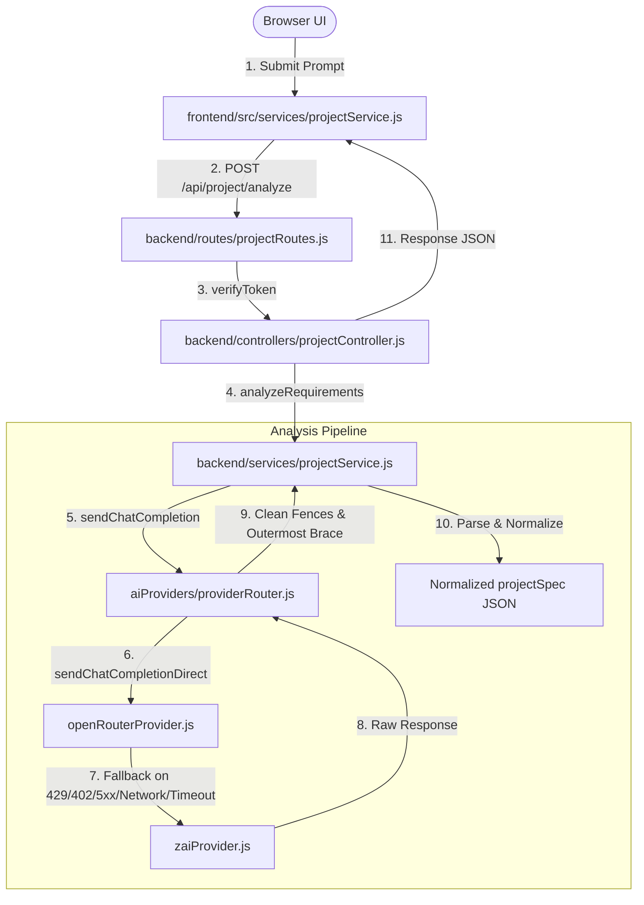

# Phase 1A — Current Requirement Payload Characterization Report

This document freezes the characterization and compatibility baselines of the requirement-analysis payload contracts prior to the introduction of the canonical ProjectSpec.

---

## 1. Executive Summary
A comprehensive inspection of the requirement-analysis pipeline in the Z.ai Local Coding Assistant has been completed. Currently, requirements analysis consists of a single-stage, prompt-driven translation step mapped directly to LLM provider completions. The generated JSON structure is parsed, cleansed of markdown fences, isolated via balanced brace counting, normalized with basic fallback defaults, and stored in MongoDB under a monolithic schema. 

This task has successfully characterized all payload shapes, consumer dependencies, fallback routines, and mutation paths. We have introduced 7 new target characterization tests, confirming that the regression baseline is fully green (115/115 tests passed).

---

## 2. Requirement Analysis Entry Points
The requirement analysis logic is initiated by user prompt submission in the frontend, leading to the following backend handlers:

1.  **Frontend Service**: [projectService.js:analyzeProject](file:///c:/Users/LENOVO/OneDrive/Desktop/z.AI/frontend/src/services/projectService.js#L4)
    - *Method*: POST to `/api/project/analyze`
    - *Input Shape*: `{ prompt: string }`
    - *Output Shape*: `{ success: true, projectSpec: Object }`
2.  **API Route**: [projectRoutes.js:L7](file:///c:/Users/LENOVO/OneDrive/Desktop/z.AI/backend/routes/projectRoutes.js#L7)
    - *Path*: `/api/project/analyze`
    - *Middleware*: `verifyToken` auth check
    - *Controller*: `projectController.analyze`
3.  **Controller Entry**: [projectController.js:analyze](file:///c:/Users/LENOVO/OneDrive/Desktop/z.AI/backend/controllers/projectController.js#L13)
    - *Responsibility*: Sanitizes the incoming prompt, calls `projectService.analyzeRequirements`, and returns JSON response payloads.
4.  **Service Handler**: [projectService.js:analyzeRequirements](file:///c:/Users/LENOVO/OneDrive/Desktop/z.AI/backend/services/projectService.js#L9)
    - *Responsibility*: Formulates system/user prompts, calls `providerRouter.sendChatCompletion` (timeout: 90000ms), cleans JSON markdown wrappers, runs outermost brace counting, executes `JSON.parse`, and assigns baseline defaults.

---

## 3. Actual Call-Path Diagram



---

## 4. Input Contract
- **Source**: `req.body.prompt` in `projectController.analyze`.
- **Constraint**: Must be a non-empty string. Checked by `!prompt || typeof prompt !== "string" || prompt.trim() === ""` returning HTTP 400.
- **Payload Shape**: `{ prompt: string }`.

---

## 5. Observed Output Variants

### 5.1 VALID_AI_PAYLOAD
- **Trigger**: AI successfully returns a well-formed JSON object containing all schema fields directly.
- **Parsed Output**: Conformant to the full 18-property JSON specification schema.

### 5.2 FENCED_JSON_PAYLOAD
- **Trigger**: AI outputs code wrapper fences (e.g., ` ```json { ... } ``` ` or ` ``` { ... } `) with optional markdown prose intro/outros.
- **Handling**: Cleans JSON boundaries using RegExp (`replace(/^```json[\r\n]*/i, "")` etc.) and runs an outermost brace counting index search (`extractJsonBlock`) to isolate the inner object.

### 5.3 PARTIAL_AI_PAYLOAD
- **Trigger**: AI returns a JSON document missing some array properties (like `backendApis` or `importantDependencies`) or string keys.
- **Handling**: Default values are assigned dynamically (arrays map to `[]`, strings map to `"None"`).

### 5.4 MALFORMED_AI_RESPONSE_FALLBACK
- **Trigger**: AI returns a string that fails `JSON.parse`.
- **Handling**: Flagged as a transient analyzer failure, triggering retry loops (up to 3 times) before throwing an error.

### 5.5 EMPTY_AI_RESPONSE_FALLBACK
- **Trigger**: AI returns `null`, empty string, or content `< 10` characters.
- **Handling**: Throws transient error, triggers retry loop.

### 5.6 PROVIDER_FAILURE_FALLBACK
- **Trigger**: HTTP 429, 402, 5xx, or network socket errors on the primary provider.
- **Handling**: The `providerRouter` intercepts the error and executes failover to the fallback provider (`zai`). If the fallback provider fails transiently, the router executes up to 3 same-provider retries. If the failover fails entirely, the analyzer (`analyzeRequirements`) catches the thrown error and retries the entire flow up to 3 times.

### 5.7 TIMEOUT_FALLBACK
- **Trigger**: Axios request socket/network timeout or ETIMEDOUT code (exceeds the 90,000ms timeout boundary).
- **Handling**: Handled identically to provider failures: primary timeout triggers fallback to `zai`, while fallback timeouts trigger up to 3 same-provider retries before escalating back to the analyzer's 3 overall retry loops.

### 5.8 UNKNOWN_STACK_PAYLOAD
- **Trigger**: AI returns a stack structure (e.g. `frontend: "Ruby on Rails", backend: "Ruby", database: "SQLite"`) not matching react, next, express, or fastapi.
- **Handling**: Dynamic profile routing detects lack of node/python matches, assigning `matchedKey = "dynamic"`.

---

## 6. Field-Level Compatibility Matrix

This matrix maps how fields returned by requirements analysis are structured and validated in the current codebase:

| Field Path | Observed Type | Produced By | Required in Practice? | Default Value | Consumer Modules | Assumptions / Constraints |
|---|---|---|---|---|---|---|
| `projectName` | `String` | AI | Yes | `"MyProject"` | `generationOrchestrator`, `previewService` | Used as folder/ZIP name. In MERN stack, sanitized to alphanumeric. |
| `projectType` | `String` | AI | Yes | `"Web Application"` | `generationPlanner`, `previewService` | Used to detect MERN stack (by substring matching `"mern"`). |
| `frontend` | `String` | AI | Yes | `"None"` | `generationPlanner`, `validationProfiles`, `stackProfiles` | Used to trigger Node/Vite checks (via string search). |
| `backend` | `String` | AI | Yes | `"None"` | `generationPlanner`, `validationProfiles`, `stackProfiles` | Used to trigger Node/Python configuration checkers. |
| `database` | `String` | AI | Yes | `"None"` | `generationPlanner`, `contractBuilder` | Triggers databaseSchemas contract generation if not `"None"`. |
| `authentication` | `String` | AI | Yes | `"None"` | `contractBuilder`, `generationOrchestrator` | Configures auth routes and README lists. |
| `designRequirements`| `String` | AI | Yes | `"None"` | `contractBuilder` | Seeding of styling packages. |
| `pagesAndRoutes` | `Array<Object>` | AI | Yes | `[]` | `contractBuilder` | Must contain `{ path, name, description }` objects. |
| `components` | `Array<Object>` | AI | Yes | `[]` | `contractBuilder` | Must contain `{ name, purpose }` objects. |
| `backendApis` | `Array<Object>` | AI | Yes | `[]` | `contractBuilder` | Must contain `{ method, path, purpose }` objects. |
| `databaseModels` | `Array<Object>` | AI | Yes | `[]` | `contractBuilder` | Must contain `{ name, fields: Array<String> }` objects. |
| `integrations` | `Array<String>` | AI | Yes | `[]` | `contractBuilder` | External integrations logging. |
| `importantDependencies`| `Array<String>`| AI | Yes | `[]` | `contractBuilder` | Array of package name strings. |
| `environmentVariables`| `Array<String>`| AI | Yes | `[]` | `contractBuilder`, `validationProfiles` | Triggers required `.env.example` existence validations. |
| `architectureConstraints`| `Array<String>`| AI | Yes | `[]` | `contractBuilder` | Documented folder restrictions. |
| `runBuildRequirements`| `Object` | AI | Yes | `{ runScript: "npm run dev", buildScript: "" }` | `generationPlanner` | Must have `runScript` and `buildScript` strings. |
| `deploymentRequirements`| `String` | AI | Yes | `"None"` | `generationOrchestrator` | Hosting platform metadata. |
| `assumptions` | `Array<String>`| AI | Yes | `[]` | `generationOrchestrator` | README assumptions logging. |

---

## 7. AI-Controlled vs. Application-Synthesized Fields
*   **AI-Controlled Fields**: The content of all specification fields is generated by the AI model. 
*   **Application-Synthesized Fields**: The backend does not currently synthesize any field in the parsed specification prior to validation, except assigning fallback string/array defaults (like `"None"` or `[]`).

---

## 8. Normalization and Defaulting Rules
- Array properties are normalized by checking `Array.isArray(property) ? property : []`.
- String fields default to the string `"None"`.
- `projectName` defaults to `"MyProject"`.
- `projectType` defaults to `"Web Application"`.
- `runBuildRequirements` defaults to `{ runScript: "npm run dev", buildScript: "" }` if undefined.

---

## 9. Fallback and Failure Behavior

### 9.1 Provider Failure Semantics Matrix
The following matrix shows how the Z.ai Local Coding Assistant handles provider failures, routing, retries, and errors across its modules:

| Failure / Error Condition | Handled/Detected By | Same-Provider Retry? | Provider Fallback? | Analyzer Retry? (in `analyzeRequirements`) | Final Propagation / Observable Behavior |
|---|---|---|---|---|---|
| **429 Rate Limit (Primary)** | `providerRouter.js` | No | Yes (calls fallback `zai`) | Yes (if fallback also fails transiently) | Router attempts failover to `zai`. If both fail after transient retries, analyzer retries the overall call up to 3 times before throwing `Failed to analyze requirements: [provider] ...`. |
| **402 Out of Credits (Primary)** | `providerRouter.js` | No | Yes (calls fallback `zai`) | Yes (if fallback also fails transiently) | Router attempts failover to `zai`. If both fail, analyzer retries overall call up to 3 times, then propagates standard error. |
| **5xx / Bad Gateway (Primary)** | `providerRouter.js` | No | Yes (calls fallback `zai`) | Yes (if fallback also fails transiently) | Router attempts failover to `zai`. If both fail, analyzer retries overall call up to 3 times, then propagates standard error. |
| **Socket / Network Failure (Primary)** | `providerRouter.js` | No | Yes (calls fallback `zai`) | Yes (if fallback also fails transiently) | Router attempts failover to `zai`. If both fail, analyzer retries overall call up to 3 times, then propagates standard error. |
| **Provider Timeout (Primary)** | `providerRouter.js` | No | Yes (calls fallback `zai`) | Yes (if fallback also fails transiently) | Router attempts failover to `zai`. If both fail, analyzer retries overall call up to 3 times, then propagates standard error. |
| **400 / 401 Auth or Config Error (Primary)** | `providerRouter.js` | No | No (not fallback eligible) | No (not transient in analyzer) | Immediately throws error `Failed to analyze requirements: [primary] ...` back to controller without any retry or fallback. |
| **429 / 5xx / Network Error (Fallback)** | `providerRouter.js` | Yes (up to 3 times, delay `attempt * 2000` ms) | N/A | Yes (if fallback loop exhausts, and code is transient) | Fallback provider retries itself up to 3 times inside the failover catch block. If all fallback retries exhaust, propagates back to analyzer. |
| **Empty Response (content length < 10)** | `projectService.js` | No | No (returns content `null` successfully to router) | Yes (sets `isTransientAnalyzeFailure = true`) | Analyzer catches empty output, throws custom transient error, and retries the entire call up to 3 times, starting back at primary. |
| **Malformed JSON** | `projectService.js` | No | No (returns raw string successfully to router) | Yes (sets `isTransientAnalyzeFailure = true`) | Analyzer parser catches exception, throws custom transient error, and retries the entire call up to 3 times, starting back at primary. |

---

## 10. Stack Selection Behavior

### 10.1 Stack Selection Rules
Matched using sequential string searches in `detectProfile` ([stackProfiles.js:L684](file:///c:/Users/LENOVO/OneDrive/Desktop/z.AI/backend/services/stackProfiles.js#L684)).
The priority checks order is: `mern` -> `react-vite` -> `nextjs` -> `express` -> `fastapi`.
If no profile is matched:
- If both `backend` and `database` are empty or `"None"`, defaults to `vanilla` profile.
- Otherwise, defaults to `dynamic` fallback profile.

### 10.2 Stack Selection Matrix

| Stack Profile | explicit matching criteria | auto-detected matching criteria | Priority Collision Heuristics |
|---|---|---|---|
| **mern** | `projectType` contains `"mern"` (case-insensitive). | `tech` string (frontend + backend + database + projectType) contains `"react"`, `"express"`, and `"mongo"`. | Highest priority. If all three exist, overrides independent React, Express, or Mongo profiles. |
| **react-vite** | `frontend` or `projectType` contains `"react"` or `"vite"`. | (Same as explicit) | Returns `false` if `next`, `express`, or `node` keywords are present in the tech string. |
| **nextjs** | `frontend` or `projectType` contains `"next"`. | (Same as explicit) | Evaluated after `react-vite`. Overrides react-vite if both are present since react-vite explicitly excludes `"next"`. |
| **express** | `backend` or `projectType` contains `"express"`, `"node"`, or `"api"`. | (Same as explicit) | Returns `false` if `react`, `fastapi`, or `python` keywords are present in the backend/projectType tech string. Note: Excludes `"react"` only if found in `backend` or `projectType` (ignores the `frontend` field completely!). |
| **fastapi** | `backend` or `projectType` contains `"fastapi"` or `"python"`. | (Same as explicit) | Evaluated after `express`. |
| **vanilla** | Catch-all for basic static pages. | None of the above profiles match AND both `backend` and `database` are empty, undefined, or `"None"`. | Low priority catch-all for pure frontend/HTML codebases. |
| **dynamic** | Catch-all for unrecognized backend technologies. | None of the above profiles match AND either `backend` or `database` is not empty and not `"None"`. | Evaluated at the end. Generates specialized scaffold layouts for Django, Flask, Rails, Go, or Rust based on backend keywords (defaulting to standard Node/HTML wrapper). |

---

## 11. Downstream Consumer Map

```
[Requirement Field]
  ├── projectName -----------> generationOrchestrator, previewService (Creates isolated directories)
  ├── projectType -----------> generationPlanner (Triggers MERN CHUNKED strategy selection)
  ├── frontend --------------> validationProfiles, stackProfiles (Node.js framework validation triggers)
  ├── backend ------------──-> validationProfiles, stackProfiles (Node.js vs Python stack routing)
  ├── database ------------──> contractBuilder (Generates schemas contracts if DB is configured)
  ├── environmentVariables ──> validationProfiles (Enforces validation checks on .env.example)
  ├── pagesAndRoutes --------> contractBuilder (Creates target routing files lists)
  └── components ------------> contractBuilder (Generates frontend view layout targets)
```

---

## 12. Payload Mutation / Identity Evidence
- **Reference Passing**: The `projectSpec` object reference returned by `analyzeRequirements` is passed completely by reference throughout all direct downstream consumers.
- **Reference Mutation Inspection**:
  A comprehensive inspection of codebases shows that **no component mutates the `projectSpec` parameter in-place, nor does any component clone it for subsequent writes**. All property accesses are strictly read-only.
- **Trace of Consumer Reads**:
  - `planGeneration(projectSpec)` in `backend/services/generationPlanner.js`: Reads pages count, components count, models count, and stack features to output a decoupled `plan` object.
  - `buildSharedContracts(projectSpec)` in `backend/services/contractBuilder.js`: Reads backend APIs, database models, environment variables, and dependencies.
  - `buildProjectManifest(originalPrompt, projectSpec)` in `backend/services/contractBuilder.js`: Reads project name, type, dependencies, pages, and components.
  - `generateScaffoldFiles(plan.scaffoldAdapter, projectSpec)` in `backend/services/scaffoldRegistry.js`: Reads project name, important dependencies, and environment variables.
  - `aiExecutor.generateUnitCode(unit, projectSpec, ...)` in `backend/services/aiGenerationExecutor.js`: Reads spec structure to compile prompts.
  - `generateRichReadme(projectSpec, finalFiles)` in `backend/services/generationOrchestrator.js`: Reads spec to compose documentation sections.
  - `validateProjectFiles(finalFiles, projectSpec)` in `backend/services/validationProfiles.js`: Reads project spec properties to enforce completeness rules.
  - `repairAffectedFiles(validationErrors, finalFiles, projectSpec, ...)` in `backend/services/aiGenerationExecutor.js`: Reads spec to formulate repair prompt instructions.
- **Concurrency Risk**: Because the spec object is treated as completely immutable under concurrent execution contexts, there is **zero concurrency risk** for concurrent project generation runs.
- **Protection Test**: The immutability invariant is frozen using the `projectSpec immutability under planner and contract building` unit test in `backend/tests/run_tests.js`.

---

## 13. Existing Implicit Identity Mechanisms
- No unique requirement ID (like `REQ-001`) currently exists in the codebase.
- The only identity trace is the monolithic MongoDB document `_id` of the generated `Project` or `History` entry.

---

## 14. Characterization Tests Added
The following targeted tests were appended to [backend/tests/run_tests.js](file:///c:/Users/LENOVO/OneDrive/Desktop/z.AI/backend/tests/run_tests.js#L1618) under the suite `Requirement Analysis Characterization (Phase 1A)`:
1.  `Valid requirement-analysis response parsing`: Validates standard spec parses and maps properties correctly.
2.  `Fenced JSON extraction with leading/trailing prose`: Tests balanced brace counting extraction.
3.  `Missing/partial fields defaults`: Asserts that missing properties are filled with stable defaults.
4.  `Malformed AI output fallback retry success`: Mocks initial parser fail to verify transient retry path.
5.  `Empty response behavior and retrying`: Mocks empty responses to verify retry loop.
6.  `Provider failure retrying and propagation`: Asserts clean exception mapping on rate limit exhaust.
7.  `Stack profiles mapping (unknown/dynamic stack)`: Confirms that unknown stacks successfully fall back to `"dynamic"` profile.
8.  `projectSpec immutability under planner and contract building`: Verifies that planner, shared contract builder, and manifest builders do not modify the input spec object.
9.  `Collision: React and Express without Mongo maps to dynamic fallback if React is in projectType`: Asserts dynamic mapping when collision occurs and React keyword is in projectType.
10. `Collision: React and Express without Mongo maps to express if React is only in frontend field`: Asserts express mapping when React is only in frontend because Express detect excludes React only if found in backend or projectType.
11. `Collision: Next.js and React maps to nextjs`: Asserts Next.js priority mapping.
12. `Collision: Django backend maps to dynamic generating django files`: Verifies Django file requirements.
13. `Collision: Vanilla fallback maps correctly on empty backend/database`: Asserts vanilla fallback path.

---

## 15. Compatibility Constraints for Phase 1B
- Any canonical `ProjectSpec` schema introduced in Phase 1B must support the default values mapping (e.g. defaulting undefined arrays to `[]` and strings to `"None"`) so downstream components do not crash.
- Downstream modules rely heavily on the current structure:
  - `projectName` must remain alphanumeric.
  - `runBuildRequirements` must retain `runScript` and `buildScript` keys.

---

## 16. Ambiguities Phase 1B Must Not Encode Silently
- **MERN Substring Matches**: Currently, a project is routed to the MERN stack if `projectType` contains `"mern"`. This is highly implicit. Phase 1B must map stack types explicitly.
- **Mongoose Connect Options**: Obsolete mongoose options are currently written by templates and stripped afterward. Phase 1B must ensure they are never included.

---

## 17. Discovered Technical Debt
- Lack of schema validation checks in requirements analysis allows AI models to output corrupt schema keys.
- Highly coupled stack checks in `detectProfile` rely on fragile substring matching.

---

## 18. Verified Facts
- Outermost brace extraction isolates JSON structures correctly from surrounding prose (Test 2).
- Failing completions are retried exactly 3 times before failing (Test 6).

---

## 19. Code-Based Inferences
- Downstream generators assume `importantDependencies` contains only valid package names.
- Sandboxing assumes `env` array parameters represent clean key names.

---

## 20. Unknowns
- How the system handles AI-generated requirements that contain conflicting constraints (e.g., using Python FastAPI with express scripts in the same spec).

---

## 21. Recommended Exact Input Contract for Task Pack 1B
For the design of Task Pack 1B (Canonical ProjectSpec Schema + Validation Boundary), the input contracts and validation boundaries must be designed around the following exact parameters:
- **ProjectSpec Structure**: Must support all 18 standard properties observed in the current contract (e.g. `projectName`, `projectType`, `frontend`, `backend`, `database`, `authentication`, `designRequirements`, `pagesAndRoutes`, `components`, `backendApis`, `databaseModels`, `integrations`, `importantDependencies`, `environmentVariables`, `architectureConstraints`, `runBuildRequirements`, `deploymentRequirements`, `assumptions`).
- **Observed Types & Defaulting**:
  - `projectName` (defaults to `"MyProject"`).
  - `projectType` (defaults to `"Web Application"`).
  - Array fields (defaults to `[]` when missing or null).
  - String fields (defaults to `"None"` when missing or null).
  - `runBuildRequirements` (defaults to `{ runScript: "npm run dev", buildScript: "" }`).
- **Validation Boundary Considerations**:
  - Validates type assertions (e.g., ensuring `pagesAndRoutes` is an array of objects containing `path`, `name`, `description`).
  - Ensures structural compatibility so downstream consumers (which expect specific types) do not encounter runtime type exceptions.
  - Sanitizes `projectName` to make it safe for filesystem directories and ZIP file packaging.
- **Immutability Invariant**:
  - Canonical specs must remain read-only configuration inputs throughout planning, contract building, scaffolding, and validation stages.
