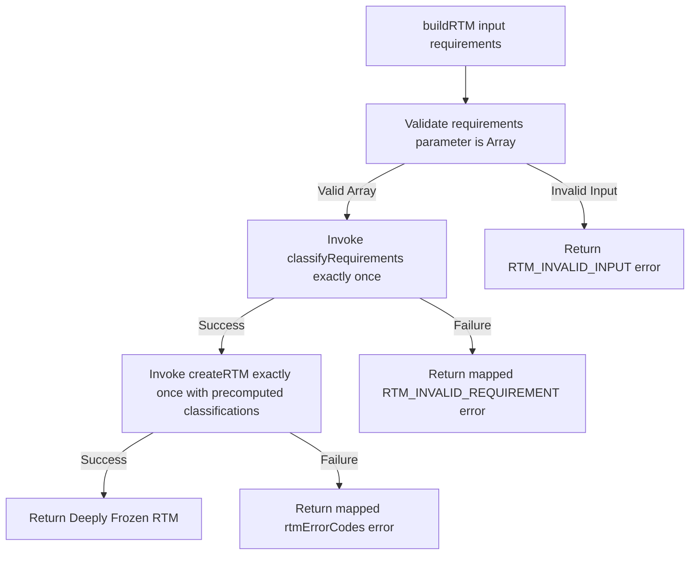

# Phase 2C — RTM-Lite Builder

This document details the coordinator logic of the Requirements Traceability Matrix builder (RTM-Lite Builder) introduced in Task Pack 2C.

---

## 1. Executive Summary

*   **Goal**: Connect Requirement Identity, Requirement Classification, and RTM Model structures deterministically.
*   **Result**: Implemented `rtmBuilder.js` as the coordinator mapping inputs cleanly through classification and formatting stages.
*   **Decoupled Domain**: The coordinator is completely isolated and runs 100% offline.
*   **Immutability**: Outputs remain deeply frozen. Unmutated caller parameter structures are guaranteed.
*   **Verification**: Added **6 new unit tests** in `run_tests.js`. All **292 unit assertions** pass successfully.

---

## 2. Public API Structure

Exposed under the unified namespace in `backend/core/rtm/index.js`:

```javascript
const { buildRTM, RTM_MODEL_VERSION, rtmErrorCodes } = require("./backend/core/rtm");
```

### 2.1 The buildRTM() API
- **Signature**: `buildRTM(requirements)`
- **Input**: `requirements[]` (array of canonical requirement descriptors derived from Requirement Identity).
- **Return Shape**:
  - Success: `{ success: true, rtmVersion: "1.0", entries: [...], metadata: { ... }, errors: [] }` (deeply frozen).
  - Failure: `{ success: false, rtmVersion: "1.0", entries: [], metadata: {}, errors: [{ code, path, message }] }` (deeply frozen).

---

## 3. Builder Flow & Execution Order

The builder executes the pipeline stages in a strict linear sequence:



---

## 4. Error Propagation Policy

The builder handles errors by returning structured failures without throwing uncaught exceptions:
- **Parameter Validation**: If the input is not a valid array, the builder immediately returns `RTM_INVALID_INPUT` and halts. No classification is called.
- **Classification Failures**: If classification returns `success: false` (e.g. malformed inputs inside requirements), the builder maps the classification error codes to `RTM_INVALID_REQUIREMENT` and returns immediately. `createRTM` is not invoked.
- **Creation Failures**: If `createRTM` returns `success: false` (e.g. duplicate stableIds), the builder propagates the failure object and does not return a partial or corrupted RTM structure.

---

## 5. Determinism & Immutability

- **Determinism**: Since all mapping routines (hashing, classifications, entry constructions) are stateless, repeated runs with identical requirements arrays yield exactly byte-equivalent JSON structures.
- **Zero Mutation**: Caller input structures are strictly read-only and never modified.
- **Isolation**: No global state, timestamps, random numbers, or runtime context IDs are used.

---

## 6. Future Phase 2D Integration

In Task Pack 2D (Production Pipeline Integration):
- **Entry point**: The orchestrator (`prepareCanonicalProjectSpec`) will invoke `buildRTM()` after canonical requirements derivation.
- **Sidecar representation**: The created RTM-Lite instance will be stored in the in-memory generation context sidecar, returning `{ projectSpec, requirementIdentity, rtm }`.
- **Database mapping**: The RTM-Lite structure will not be saved directly to Mongoose models to prevent schema drift, but will serve as the runtime verification blueprint.

---

## 7. Tests Index (Phase 2C suite)

Located in [run_tests.js](file:///c:/Users/LENOVO/OneDrive/Desktop/z.AI/backend/tests/run_tests.js#L4458).

| Test # | Test Name | Objective Covered |
|---|---|---|
| 1 | Rejects invalid non-array inputs | Validates array boundary safety. |
| 2 | Invokes classifyRequirements and createRTM exactly once | Checks coordinator call counts using internal test seams. |
| 3 | Classification failure prevents RTM creation | Proves that classification failures halt execution. |
| 4 | createRTM failure propagates correctly | Asserts that creation errors (such as duplicate stableIds) propagate without partial returns. |
| 5 | Determinism and deep freezing | Verifies frozen structures and byte-equivalent outputs. |
| 6 | Caller input is never mutated | Validates that the input array remains unchanged post-run. |
