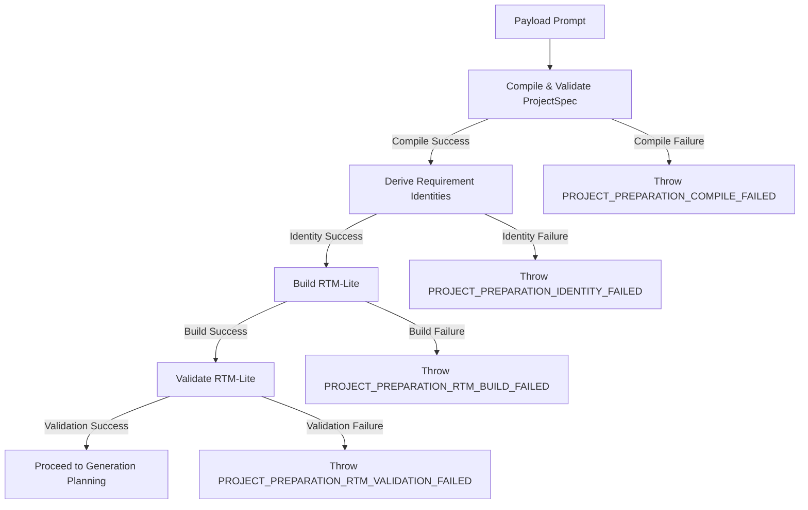

# Phase 2E — RTM Pipeline Integration

This document outlines the pipeline integration details, execution order, error codes, and safety boundaries established for the Requirements Traceability Matrix (RTM-Lite) in Task Pack 2E.

---

## 1. Executive Summary

*   **Goal**: Integrate RTM-Lite build and validation logic into the production generation preparation pipeline as an internal sidecar.
*   **Result**: Integrated `buildRTM` and `validateRTM` inside `prepareCanonicalProjectSpec` in `backend/services/generationOrchestrator.js`.
*   **Decoupled Sidecar**: RTM acts as a memory-only sidecar. No database tables, REST schemas, or SSE responses were altered.
*   **Fail-Fast Boundaries**: Any build or validation failures throw structured errors and halt the generation orchestrator prior to code planning or scaffold operations.
*   **Verification**: Registered **7 new integration tests** in `run_tests.js`. All **309 backend unit assertions** pass successfully.

---

## 2. Production Integration Points

RTM building and validation are integrated directly into the preparation loop:

```javascript
// Located in backend/services/generationOrchestrator.js -> prepareCanonicalProjectSpec
const rtmResult = _testHooks.buildRTM(identityResult.requirements);
if (!rtmResult.success) {
    const err = new Error("RTM construction failed: " + ...);
    err.code = "PROJECT_PREPARATION_RTM_BUILD_FAILED";
    err.errors = rtmResult.errors;
    throw err;
}

const validationResult = _testHooks.validateRTM(rtmResult);
if (!validationResult.success) {
    const err = new Error("RTM validation failed: " + ...);
    err.code = "PROJECT_PREPARATION_RTM_VALIDATION_FAILED";
    err.errors = validationResult.errors;
    throw err;
}
```

---

## 3. Pipeline Execution Sequence

The preparation pipeline now enforces the following sequence:



---

## 4. Failure Boundaries

The orchestrator halts instantly if any pipeline stage fails. If an error is thrown, execution never enters the scaffold generation or AI agent code generation loops:
*   **Compiler Errors**: Halts with code `PROJECT_PREPARATION_COMPILE_FAILED`.
*   **Identity Errors**: Halts with code `PROJECT_PREPARATION_IDENTITY_FAILED`.
*   **RTM Builder Errors**: Halts with code `PROJECT_PREPARATION_RTM_BUILD_FAILED`.
*   **RTM Validator Errors**: Halts with code `PROJECT_PREPARATION_RTM_VALIDATION_FAILED`.

---

## 5. Sidecar & Persistence Policy

To prevent database bloating and schema degradation:
*   **No DB Writes**: The persistence adapter `adaptProjectSpecForPersistence` clones the canonical Spec and completely ignores the `rtm` property. No RTM data is ever saved to Mongoose `Project` or `History` models.
*   **No API Exposure**: The return statement of the public orchestrator function `orchestrateGeneration` does not output `rtm`.
*   **No Client Leakage**: The REST API endpoints and Server-Sent Event (SSE) progress streams are completely isolated from RTM objects.

---

## 6. Compatibility Guarantees

*   **API Response Consistency**: The JSON structure returned by `/api/projects/generate` remains identical to Phase 1E baseline.
*   **SSE Progressive Loop**: Progress event structures (`stage`, `progress`, etc.) continue to function without any signature adjustments.
*   **Mongoose Collections Integrity**: Project spec documents are persisted without schema updates.

---

## 7. Tests Index (Phase 2E suite)

Located in [run_tests.js](file:///c:/Users/LENOVO/OneDrive/Desktop/z.AI/backend/tests/run_tests.js#L4738).

| Test # | Test Name | Objective Covered |
|---|---|---|
| 1 | RTM builder executes exactly once in preparation pipeline | Asserts builder count incrementing correctly. |
| 2 | RTM validator executes exactly once in preparation pipeline | Asserts validator count incrementing correctly. |
| 3 | Builder failure prevents generation and throws correct error code | Asserts that builder failure throws `PROJECT_PREPARATION_RTM_BUILD_FAILED`. |
| 4 | Validator failure prevents generation and throws correct error code | Asserts that validator failure throws `PROJECT_PREPARATION_RTM_VALIDATION_FAILED`. |
| 5 | RTM remains frozen in preparation result | Checks frozen state in memory. |
| 6 | RTM never reaches persistence adapter | Confirms database models spec adaptions prune RTM parameters. |
| 7 | RTM sidecar is not returned by public orchestrateGeneration result | Statically parses orchestrator returns to verify zero leak occurrences. |
