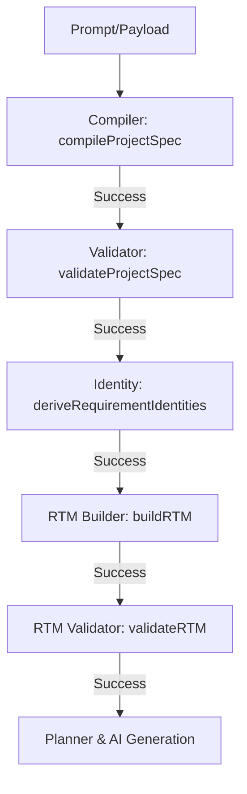

# Phase 2 Final Architecture Audit

This document presents a complete architectural review and safety audit of everything designed and implemented during Phase 2 (Requirement Validator + RTM-Lite).

---

## 1. Executive Summary

*   **Status**: Complete ✅
*   **Result**: GO &mdash; The Phase 2 codebase is hardened, 100% verified, and fully ready for Phase 3.
*   **Decoupling**: Both `core/requirementsClassification` and `core/rtm` domains are decoupled from persistence and client controllers.
*   **Immutability**: Strict deep freezing via recursively applied `deepFreeze` is enforced at all internal data borders.
*   **Exactly-Once Execution**: Compile, validate, identity derivation, RTM build, and RTM validation execution sequences run exactly once per generation pipeline invocation.
*   **Regression Status**: **309 / 309 unit test assertions pass successfully** (100% pass rate).

---

## 2. Architecture Review

### 2.1 Requirement Classification Domain
*   **Location**: `backend/core/requirementsClassification/`
*   **Design**: Deterministic mapping rules without fuzzy regex or AI provider calls.
*   **Primary Category**: Evaluated strictly from requirement `kind` mappings:
    *   `pageRoute` / `route` &rarr; `ROUTE`
    *   `component` &rarr; `UI`
    *   `backendApi` / `api` &rarr; `API`
    *   `databaseModel` / `database` &rarr; `DATABASE`
    *   `frontend` &rarr; `FRONTEND`
    *   `backend` &rarr; `BACKEND`
    *   `authentication` &rarr; `AUTH`
    *   `integration` &rarr; `INTEGRATION`
    *   `deploymentRequirement` / `deploymentRequirements` &rarr; `DEPLOYMENT`
    *   `architectureConstraint` / `architecture` &rarr; `ARCHITECTURE`
    *   `designRequirement` / `designRequirements` &rarr; `DESIGN`
    *   Any other type &rarr; `OTHER`
*   **Secondary Tags**: Match uppercase, alphabetically sorted, unique tag keywords (such as `AUTH`, `PAYMENT`, `ADMIN`, `AI`, `CHAT`, `VIDEO`, `EMAIL`, `STORAGE`, `ANALYTICS`, `NOTIFICATION`) using regex word boundaries `\bkeyword\b` to avoid false substring detections.

### 2.2 RTM Model, Builder & Validator
*   **Location**: `backend/core/rtm/`
*   **RTM Model**: Instantiates the matrix structure holding `stableId`, `displayId`, `kind`, `semanticKey`, `primaryCategory`, `secondaryTags`, `status` (UNTRACKED | PLANNED | GENERATED | VERIFIED | FAILED), `evidence` objects, and trace metadata.
*   **Builder**: Coordinates the linear pipeline: Requirements &rarr; Classification &rarr; RTM Creation. Invokes classification and model creation exactly once.
*   **Validator**: Validates structural properties, metadata schemas, sequential formatting of `displayId`, tag casing/sorting/uniqueness, and deep-frozen immutability states. Never mutates parameters.

---

## 3. Pipeline Review & Execution Order

The generation pipeline follows a strict, sequential prep process before planning or AI executor invocation:

### Exactly-Once Invocations
Unit tests verify that during a normal preparation flow:
*   `compileProjectSpec` executes exactly once.
*   `validateProjectSpec` executes exactly once.
*   `deriveRequirementIdentities` executes exactly once.
*   `buildRTM` executes exactly once.
*   `validateRTM` executes exactly once.

---

## 4. Sidecar & Persistence Audit

To ensure the RTM behaves strictly as an in-memory compiler sidecar:
*   **No DB Schema Bloat**: Mongoose models (`Project` and `History`) remain completely free of RTM schemas.
*   **Persistence Adapter Isolation**: `adaptProjectSpecForPersistence` strips out all external parameters from the canonical Spec, ensuring no RTM properties reach database write payloads.
*   **No API Exposure**: Public REST controllers destructure the return statement of `orchestrateGeneration` which has been confirmed to not return `rtm`.
*   **No SSE progressive stream leak**: The progression loop is not affected by RTM properties.

---

## 5. Immutability Audit

*   **ProjectSpec**: Deeply frozen during compilation.
*   **Requirement Identity**: Deeply frozen during identity derivation.
*   **RTM**: The root, entries list, entry structures, secondary tags list, evidence maps, and metadata scopes are all deeply frozen via recursive `deepFreeze`.
*   **No Shared Mutability**: No references are shared with caller parameters or subsequent planning processes, avoiding side effects.

---

## 6. Error Flow Audit

The prep loop halts instantly if any error occurs:
1.  **Compile Failures**: Throws `PROJECT_PREPARATION_COMPILE_FAILED` (Halts execution).
2.  **Identity Failures**: Throws `PROJECT_PREPARATION_IDENTITY_FAILED` (Halts execution).
3.  **RTM Builder Failures**: Throws `PROJECT_PREPARATION_RTM_BUILD_FAILED` (Halts execution).
4.  **RTM Validator Failures**: Throws `PROJECT_PREPARATION_RTM_VALIDATION_FAILED` (Halts execution).

No planning loops, VFS file writes, or MongoDB connections occur after a preparation failure.

---

## 7. Technical Debt

*   **Helper Duplication**: The `deepFreeze` recursive function is duplicated across classifier, model, builder, and validator modules. While this introduces minor duplication, it keeps the domain modules self-contained without creating brittle external utility couplings.
*   **Future Cleanup**: In Phase 3, we can create a central `core/utils/` helper if the pattern continues to expand, but current isolation remains acceptable.

---

## 8. Test Audit & Regression Results

A total of **30 unit and integration tests** cover the Phase 2 requirements, verifying boundary states, edge-case keywords, casing, sequence offsets, duplicates, errors propagation, and sidecar isolation.

*   **Total Tests**: 309 assertions
*   **Passed**: 309
*   **Failed**: 0
*   **Skipped**: 0

---

## 9. GO / NO-GO Recommendation

### GO ✅
Phase 2 (Requirement Classification, RTM Model, Builder, Validator, and Pipeline Integration) is complete, hardened, and regression-green. The architectural foundations are stable. We are fully ready to proceed to Phase 3.
