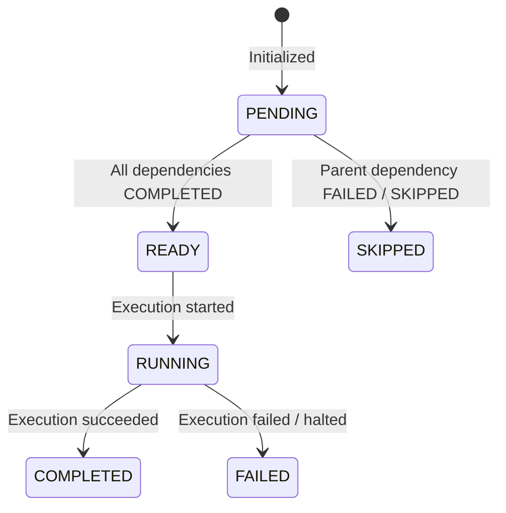

# Phase 3A — TaskGraph Domain Model

This document outlines the design and implementation details for the TaskGraph canonical domain model constructed in Task Pack 3A.

---

## 1. Executive Summary

*   **Objective**: Create the core domain model representing the execution task graph.
*   **Result**: Created `backend/core/taskGraph/` consisting of:
    *   `taskGraphErrors.js`: Error taxonomy definitions.
    *   `taskGraphModel.js`: Immutable task graph creation logic.
    *   `index.js`: Exposing public imports cleanly.
*   **Decoupling**: No database mutations, AI generation hooks, planner integration, topological sorting, or scheduling are implemented.
*   **Tests**: Added **8 new unit tests** validating validation schemas, duplicate `stableId` detection, frozen immutability, determinism, and input cloning.

---

## 2. Task Node Contract

Each task node represents an execution step mapped directly from a canonical Requirement Identity object:

| Field | Type | Description | Initial Value / Constraints |
|---|---|---|---|
| `stableId` | `String` | Stable SHA-256 requirement identifier | Derived from requirement. |
| `displayId` | `String` | Human-readable requirement sequence display key | e.g. `REQ-001`. |
| `kind` | `String` | Category classification type | e.g. `component`, `pageRoute`. |
| `semanticKey` | `String` | Unique semantic representation | e.g. `Navbar`, `/home`. |
| `status` | `String` | Current task lifecycle state | Starts as `PENDING`. |
| `dependencies` | `Array` | List of parent task stableIds | Initialized to `[]`. |
| `metadata` | `Object` | Node versioning metadata parameters | Contains version identifiers. |
| `payload` | `Object` | The core payload of the requirement | Deeply cloned from input. |

---

## 3. Status Lifecycle

While only the initial state is instantiated currently, the full conceptual task execution lifecycle is defined as follows:

*   `PENDING`: Node is created and awaits evaluation.
*   `READY`: All upstream dependencies have successfully resolved to `COMPLETED`.
*   `RUNNING`: The task runner is actively executing code planning or generation.
*   `COMPLETED`: The task generated successfully and validated.
*   `FAILED`: Task execution failed or validation errors occurred.
*   `SKIPPED`: Task bypassed because a prerequisite task failed.

---

## 4. Metadata Contract

Each node and the parent graph hold strict version parameters to ensure compatibility across future task executors:
*   `graphVersion`: Instantiated to `"1.0"`.
*   `identityVersion`: Instantiated to `"1.0"`.
*   `createdBy`: Instantiated to `"task-graph"`.
*   **Timestamps & Runtime IDs**: Banned to ensure complete output determinism.

---

## 5. Error Taxonomy

All error flows return structured results in the `errors` array matching these codes:

*   `TASK_GRAPH_INVALID_INPUT`: Returned if the requirements parameter is not a valid list.
*   `TASK_GRAPH_INVALID_REQUIREMENT`: Returned if any individual requirement object lacks `stableId`, `displayId`, `kind`, `semanticKey`, or `payload`.
*   `TASK_GRAPH_DUPLICATE_NODE`: Returned if duplicate `stableId` properties are detected across requirements.
*   `TASK_GRAPH_INTERNAL_ERROR`: Catch-all for unexpected runtime exceptions during compilation.

---

## 6. Immutability & Determinism

*   **Deep Cloning**: `payload` structures are deeply cloned using `JSON.parse(JSON.stringify(req.payload))` to avoid caller state mutation.
*   **Deep Freezing**: Recursive `deepFreeze` recursively locks nodes, configurations, and array elements to prevent tampering during graph traversal.
*   **Determinism**: Given identical requirements, `createTaskGraph` outputs identical, reproducible graph configurations.
