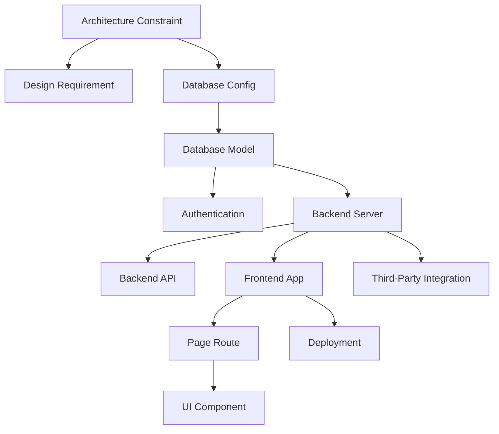

# Phase 3B — Dependency Rule Engine

This document outlines the architecture, rules model, and integration properties of the Dependency Rule Engine built in Task Pack 3B.

---

## 1. Executive Summary

*   **Objective**: Build a deterministic dependency mapping module that declares allowed and expected dependency relationships between requirement kinds.
*   **Result**: Created `backend/core/taskGraph/dependencyRules.js` exporting getDependencyRules and getDependenciesForKind.
*   **Decoupling**: No graph construction, DAG validation, or pipeline integrations are performed here.
*   **Tests**: Added **4 new unit tests** covering known kinds validation, unknown kinds rejection, immutability, and determinism.
*   **Status**: Regression baseline at **321 assertions passing**.

---

## 2. Dependency Philosophy & Rule Mapping

Requirement kinds depend on one another based on technical layers. Lower-level backend and database layers must generate successfully before higher-level user interface layers are planning or scaffolding:

### Dependency Rules Model Configuration:
*   `architectureConstraint`: Depends on `[]` (Leaf configurations).
*   `designRequirement`: Depends on `["architectureConstraint"]`.
*   `database`: Depends on `["architectureConstraint"]`.
*   `databaseModel`: Depends on `["database", "architectureConstraint"]`.
*   `authentication`: Depends on `["database", "databaseModel", "architectureConstraint"]`.
*   `backend`: Depends on `["database", "architectureConstraint"]`.
*   `backendApi`: Depends on `["backend", "authentication", "databaseModel", "architectureConstraint"]`.
*   `frontend`: Depends on `["backend", "architectureConstraint"]`.
*   `pageRoute`: Depends on `["frontend", "designRequirement", "architectureConstraint"]`.
*   `component`: Depends on `["pageRoute", "frontend", "designRequirement", "architectureConstraint"]`.
*   `integration`: Depends on `["backend", "databaseModel", "architectureConstraint"]`.
*   `deploymentRequirement`: Depends on `["frontend", "backend", "database", "architectureConstraint"]`.

---

## 3. Supported Kinds

The module strictly validates that input kinds match one of the 12 supported strings:
*   `frontend`
*   `backend`
*   `authentication`
*   `database`
*   `pageRoute`
*   `component`
*   `backendApi`
*   `databaseModel`
*   `integration`
*   `deploymentRequirement`
*   `architectureConstraint`
*   `designRequirement`

---

## 4. API Reference

*   `getDependencyRules()`: Returns the complete rule configuration map. The return dictionary and all nested arrays are deeply frozen.
*   `getDependenciesForKind(kind)`: Returns the array of allowed prerequisite kinds for the specified kind argument.
*   `taskGraphDependencyVersion`: Holds version constant `"1.0"`.

---

## 5. Error Taxonomy

*   `TASK_GRAPH_INVALID_KIND`: Thrown if the kind is null, undefined, not a string, or contains empty/whitespace values.
*   `TASK_GRAPH_UNKNOWN_KIND`: Thrown if the kind parameter is not a supported schema string.
*   `TASK_GRAPH_INTERNAL_ERROR`: Catch-all for execution failures.

---

## 6. Future DAG Builder Integration

This module owns **only** the schema rules. It does not perform dynamic graph calculation or node resolving:
*   **Task Pack 3B Scope**: Provides static allowed dependency mapping queries.
*   **Task Pack 3C Scope (Next)**: The DAG builder will consume `getDependenciesForKind` to parse requirement stableIds and displayId links to construct the operational TaskGraph.
