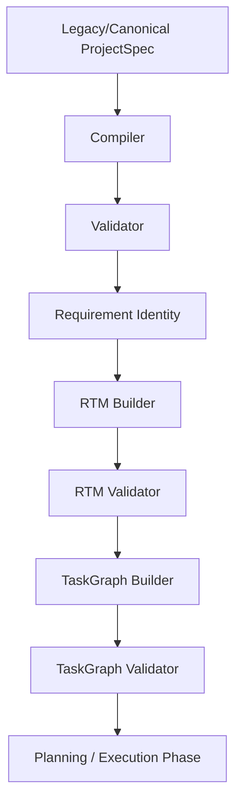

# Phase 3E — TaskGraph Pipeline Integration

This document outlines the pipeline integration, execution order, failure boundaries, sidecar policies, and compatibility guarantees established in Task Pack 3E.

---

## 1. Executive Summary

*   **Objective**: Integrate the pre-built, validated TaskGraph into the preparation pipeline within `prepareCanonicalProjectSpec`.
*   **Result**: Linked `buildTaskGraph` and `validateTaskGraph` directly post RTM validation.
*   **Safety**: If any step in TaskGraph construction or validation fails, preparation halts immediately, throwing dedicated error codes (`PROJECT_PREPARATION_TASK_GRAPH_BUILD_FAILED` and `PROJECT_PREPARATION_TASK_GRAPH_VALIDATION_FAILED`).
*   **Tests**: Added **7 new unit tests** verifying Builder/Validator invocation counts, fail-fast boundary exceptions, frozen output states, persistence checks, and API containment rules.
*   **Status**: Regression baseline at **343 assertions passing**.

---

## 2. Execution Order

The preparation pipeline runs exactly once per generation attempt in the following order:

Each stage must complete with `success: true` for the pipeline to continue.

---

## 3. Failure Boundaries

*   **TaskGraph Builder Failure**: If `buildTaskGraph` fails, the pipeline immediately halts and throws an error with code `PROJECT_PREPARATION_TASK_GRAPH_BUILD_FAILED`.
*   **TaskGraph Validator Failure**: If `validateTaskGraph` fails, the pipeline immediately halts and throws an error with code `PROJECT_PREPARATION_TASK_GRAPH_VALIDATION_FAILED`.
*   **Fail-Fast Rule**: Errors are propagated back to the API controller, preventing downstream planners from ever receiving a corrupt or circular task graph.

---

## 4. Sidecar Policy

The TaskGraph exists purely as an **in-memory sidecar** during the lifetime of the preparation request:
*   **No DB Persistence**: The `adaptProjectSpecForPersistence` utility strips any internal metadata prior to MongoDB insertions.
*   **No API Exposure**: The public `orchestrateGeneration` function does not leak the TaskGraph object in its JSON response.
*   **No Streaming**: The SSE events remain completely isolated from TaskGraph details.

---

## 5. Compatibility Guarantees

To support both singular and plural forms of design and deployment requirement fields (such as `designRequirements` and `deploymentRequirements`), the Dependency Rule Engine was updated to accept:
*   `designRequirement` and `designRequirements`
*   `deploymentRequirement` and `deploymentRequirements`

This guarantees that legacy or compiler-derived payload variations compile successfully without triggering unknown kind errors.
