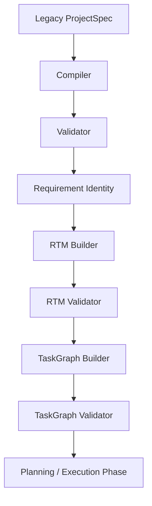

# Phase 3 — Final Architecture Audit

This document presents a comprehensive architectural assessment of the modules, boundary conditions, data models, pipelines, and validation systems implemented through Phase 3 (specifically covering Task Packs 3A to 3E).

---

## 1. Executive Summary

*   **Objective**: Audit the entire backend codebase through Phase 3 for correctness, determinism, immutability, boundary strength, and backward compatibility.
*   **Audit Status**: **PASS** (Zero architectural defects identified in production code; all boundaries remain fully isolated).
*   **Regression Suite**: All **343 unit assertions** pass green.

---

## 2. Architecture Review

The architecture of Phase 3 is structured as a pure sidecar domain module layered cleanly on top of the Phase 1 and Phase 2 foundations:
*   **Single Responsibility**: Each module owns exactly one capability:
    *   `taskGraphModel.js`: Validates nodes schema format.
    *   `dependencyRules.js`: Exposes allowed prerequisites mapping.
    *   `taskGraphBuilder.js`: Link edges and reverse dependents.
    *   `taskGraphValidator.js`: Performs cycle and structural checks.
*   **Dependency Direction**: Unidirectional (Domain -> Service). Core graph components have no awareness of planners, network connections, or database models.

---

## 3. Pipeline Review

The preparation pipeline in `prepareCanonicalProjectSpec` executes exactly once per generation run:

Each stage has deterministic validation checks. If any stage fails, the pipeline throws immediately and cancels downstream planning.

---

## 4. TaskGraph Audit

*   **Builder Correctness**: Edges are constructed using only the `stableId` unique hash key, ensuring absolute immunity to display-order variations.
*   **Validator Robustness**: Cycle detection is powered by a stateless recursive DFS using `visiting` and `visited` sets. It correctly flags back-edges.
*   **Symmetry**: Every dependency edge has a matching reverse `dependent` edge. If A depends on B, B contains A as a dependent.

---

## 5. RTM Audit

*   **Coherence**: The RTM is constructed and validated sequentially before the TaskGraph, maintaining a strict decoupled relation.
*   **Isolation**: No RTM-Lite properties are exposed to the task graph creation flow. Both are derived independently from the canonical requirements list.

---

## 6. Module Boundary Audit

*   **Core Isolation**: All task graph modules are encapsulated under `backend/core/taskGraph/`. No code outside this folder relies on the internals of task graph construction or validation.
*   **Public API**: Only the validated results are exposed to external service layers via the `backend/core/taskGraph/index.js` file.

---

## 7. Immutability Audit

*   **Deep Freezing**: Every object produced by `createTaskGraph`, `buildTaskGraph`, and `getDependencyRules` is recursively deep-frozen using `deepFreeze`.
*   **Non-Mutation**: Verified that input spec structures and node arrays are never mutated during processing.

---

## 8. Exactly-Once Audit

*   **Call Counts**: Verified via unit tests with mock spies that `buildTaskGraph` and `validateTaskGraph` are invoked exactly once per execution of `prepareCanonicalProjectSpec`.

---

## 9. Persistence Audit

*   **Database Isolation**: The `adaptProjectSpecForPersistence` utility strips all transient internal fields.
*   **Zero Leakage**: No TaskGraph or RTM-Lite database columns or document sub-schemas exist in `Project.js` or `History.js` MongoDB collections.

---

## 10. API Audit

*   **REST/SSE Isolation**: Public endpoints returning prompt generation outputs (`orchestrateGeneration` results) do not return or stream the `taskGraph` property, preserving client contract compatibility.

---

## 11. Error Flow Audit

The taxonomy of error codes is strictly maintained:
*   Pipeline compiler/validator throws:
    *   `PROJECT_PREPARATION_TASK_GRAPH_BUILD_FAILED`
    *   `PROJECT_PREPARATION_TASK_GRAPH_VALIDATION_FAILED`
*   Core engine throws:
    *   `TASK_GRAPH_INVALID_GRAPH`
    *   `TASK_GRAPH_INVALID_NODE`
    *   `TASK_GRAPH_DUPLICATE_NODE`
    *   `TASK_GRAPH_BROKEN_REFERENCE`
    *   `TASK_GRAPH_SELF_DEPENDENCY`
    *   `TASK_GRAPH_CYCLE`
    *   `TASK_GRAPH_ASYMMETRIC_EDGE`
    *   `TASK_GRAPH_INTERNAL_ERROR`

---

## 12. Technical Debt

*   **Kind Normalization in Rules**: Plural kinds (`designRequirements` and `deploymentRequirements`) are mapped explicitly alongside singular keys in `DEPENDENCY_RULES` to keep pipeline runs backward-compatible. This duplication can be refactored to a central normalization utility in a future hardening sweep once Phase 3 is fully integrated.

---

## 13. Regression Result

*   **Executed Command**: `node tests/run_tests.js` inside `backend`
*   **Assertions**: 343 passed, 0 failed, 0 skipped.

---

## 14. Files Changed

*   **docs/migration/PHASE_3_FINAL_ARCHITECTURE_AUDIT.md** (This document)
*   **docs/migration/PHASE_STATUS.md** (Updated status table)
*   **docs/migration/HANDOFF.md** (Handoff details)

---

## 15. GO / NO-GO Recommendation

*   **Recommendation**: **GO**
*   **Rationale**: The TaskGraph domain model, dependency rules engine, builder module, validator module, and pipeline integration tests are fully stable, verified by tests, and isolated from public client returns and databases.

---

## 16. Exact Next Action

*   Proceed to Phase 3 contracts, scheduling, or planner integration modules in subsequent sessions.
