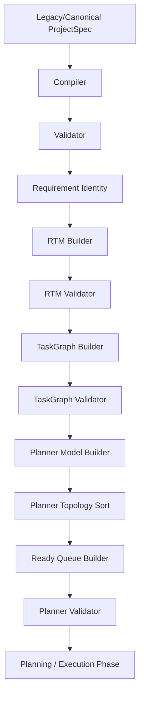

# Phase 4E — Planner Pipeline Integration

This document outlines the pipeline integration, execution order, failure policies, and sidecar containment protocols established in Task Pack 4E.

---

## 1. Executive Summary

*   **Objective**: Integrate the validated Planner Domain Model, Topological Planner, Ready Queue, and Planner Validator into the preparation pipeline within `prepareCanonicalProjectSpec`.
*   **Result**: Linked all Phase 4 modules sequentially immediately following TaskGraph validation.
*   **Safety**: If any step in planner model construction, topological sorting, ready queue building, or planner validation fails, preparation halts immediately, preventing downstream planning with dedicated error codes.
*   **Tests**: Added **11 new unit tests** verifying builder/validator call counts, fail-fast boundary exceptions, frozen output states, database isolation, and public API response containment.
*   **Status**: Regression baseline at **384 assertions passing**.

---

## 2. Execution Order

The preparation pipeline runs exactly once per generation attempt in the following order:

Each stage must complete with `success: true` for the pipeline to continue.

---

## 3. Failure Boundaries

Dedicated error codes are thrown to halt preparation immediately if any step fails:
*   **Planner Model Builder Failure**: Throws error code `PROJECT_PREPARATION_PLANNER_BUILD_FAILED`.
*   **Planner Topology Failure**: Throws error code `PROJECT_PREPARATION_PLANNER_TOPOLOGY_FAILED`.
*   **Ready Queue Builder Failure**: Throws error code `PROJECT_PREPARATION_PLANNER_READY_FAILED`.
*   **Planner Validator Failure**: Throws error code `PROJECT_PREPARATION_PLANNER_VALIDATION_FAILED`.

Downstream planning is completely blocked in the event of any of these failures.

---

## 4. Sidecar Policy

The Planner exists strictly as an **in-memory sidecar** during the lifecycle of the preparation request:
*   **No DB Persistence**: The `adaptProjectSpecForPersistence` utility strips any internal metadata prior to MongoDB insertions.
*   **No API Exposure**: The public `orchestrateGeneration` function does not leak the Planner object in its JSON response.
*   **No Streaming**: The SSE events remain completely isolated from Planner details.
