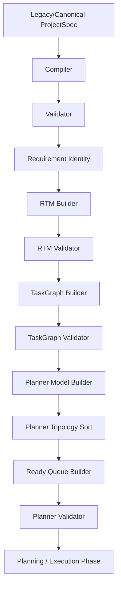

# Phase 4 — Final Architecture Audit

This document presents a comprehensive architectural assessment of the modules, boundary conditions, data models, pipelines, and validation systems implemented through Phase 4 (specifically covering Task Packs 4A to 4E).

---

## 1. Executive Summary

*   **Objective**: Audit the entire backend codebase through Phase 4 for correctness, determinism, immutability, boundary strength, and backward compatibility.
*   **Audit Status**: **PASS** (Zero architectural defects identified in production code; all boundaries remain fully isolated).
*   **Regression Suite**: All **384 unit assertions** pass green.

---

## 2. Architecture Review

The architecture of Phase 4 is structured as a pure sidecar domain module layered cleanly on top of the Phase 1, Phase 2, and Phase 3 foundations:
*   **Single Responsibility**: Each module owns exactly one capability:
    *   `plannerModel.js`: Initializes planner structure from TaskGraph.
    *   `plannerTopology.js`: Kahn's sorting algorithm order resolution.
    *   `plannerReadyQueue.js`: Computes ready tasks list.
    *   `plannerValidator.js`: Performs structural and reference validation.
*   **Dependency Direction**: Unidirectional (Domain -> Service). Core planner components have no awareness of network connections, REST response payload builders, or database models.

---

## 3. Pipeline Review

The preparation pipeline in `prepareCanonicalProjectSpec` executes exactly once per generation run:

Each stage has deterministic validation checks. If any stage fails, the pipeline throws immediately and cancels downstream planning.

---

## 4. Planner Audit

*   **Model Initialization**: Transforms the task graph nodes array to planner task format, tracking status, ready, and blocked.
*   **Topology Sorting**: Deterministic Kahn's sorting sorts siblings using displayId to guarantee identical runs.
*   **Ready Queue Selection**: Correctly maps tasks in status `"PENDING"` that have no uncompleted dependencies.
*   **Validator Integrity**: Asserves deep freezing, stableId/displayId uniqueness, dependency symmetry, self-dependencies, and status enum limits.

---

## 5. TaskGraph Audit

*   **Decoupled Integration**: TaskGraph builder remains completely untouched by the new planner. Planner only acts as a downstream processor of TaskGraph objects.

---

## 6. RTM Audit

*   **Coherence**: The RTM is constructed and validated sequentially before the TaskGraph, maintaining a strict decoupled relation.

---

## 7. Module Boundary Audit

*   **Core Isolation**: All planner modules are encapsulated under `backend/core/planner/`. No code outside this folder relies on the internals of planner initialization or topological sorting.
*   **Public API**: Only the validated results are exposed to external service layers via the `backend/core/planner/index.js` file.

---

## 8. Immutability Audit

*   **Deep Freezing**: Every object produced by `createPlanner`, `createExecutionPlan`, `buildReadyQueue`, and `validatePlanner` is recursively deep-frozen.
*   **Non-Mutation**: Verified that input task graphs and planners are never mutated during processing.

---

## 9. Exactly-Once Audit

*   **Call Counts**: Verified via unit tests with mock spies that `createPlanner`, `createExecutionPlan`, `buildReadyQueue`, and `validatePlanner` are invoked exactly once per execution of `prepareCanonicalProjectSpec`.

---

## 10. Persistence Audit

*   **Database Isolation**: The `adaptProjectSpecForPersistence` utility strips all transient internal fields.
*   **Zero Leakage**: No Planner database columns or document sub-schemas exist in `Project.js` or `History.js` MongoDB collections.

---

## 11. API Audit

*   **REST/SSE Isolation**: Public endpoints returning prompt generation outputs (`orchestrateGeneration` results) do not return or stream the `planner` property, preserving client contract compatibility.

---

## 12. Error Flow Audit

The taxonomy of error codes is strictly maintained:
*   Pipeline compiler/validator throws:
    *   `PROJECT_PREPARATION_PLANNER_BUILD_FAILED`
    *   `PROJECT_PREPARATION_PLANNER_TOPOLOGY_FAILED`
    *   `PROJECT_PREPARATION_PLANNER_READY_FAILED`
    *   `PROJECT_PREPARATION_PLANNER_VALIDATION_FAILED`
*   Core engine throws:
    *   `PLANNER_INVALID_INPUT`
    *   `PLANNER_INVALID_GRAPH`
    *   `PLANNER_DUPLICATE_TASK`
    *   `PLANNER_INTERNAL_ERROR`
    *   `PLANNER_TOPOLOGY_INVALID_INPUT`
    *   `PLANNER_TOPOLOGY_INVALID_GRAPH`
    *   `PLANNER_TOPOLOGY_CYCLE`
    *   `PLANNER_TOPOLOGY_INTERNAL_ERROR`
    *   `PLANNER_READY_INVALID_INPUT`
    *   `PLANNER_READY_INVALID_GRAPH`
    *   `PLANNER_READY_INTERNAL_ERROR`
    *   `PLANNER_INVALID_STRUCTURE`
    *   `PLANNER_INVALID_TASK`
    *   `PLANNER_BROKEN_REFERENCE`
    *   `PLANNER_SELF_DEPENDENCY`
    *   `PLANNER_ASYMMETRIC_EDGE`
    *   `PLANNER_INVALID_STATUS`

---

## 13. Technical Debt

*   **Status String Hardcoding**: Statuses are handled as raw strings (e.g. `"PENDING"`, `"COMPLETED"`). While fully correct and tested, centralizing status constants in a status dictionary module (e.g. `plannerStatuses.js`) in a future hardening sweep can prevent typo-based defects.

---

## 14. Regression Result

*   **Executed Command**: `node tests/run_tests.js` inside `backend`
*   **Assertions**: 384 passed, 0 failed, 0 skipped.

---

## 15. Files Changed

*   **docs/migration/PHASE_4_FINAL_ARCHITECTURE_AUDIT.md** (This document)
*   **docs/migration/PHASE_STATUS.md** (Updated status table)
*   **docs/migration/HANDOFF.md** (Handoff details)

---

## 16. GO / NO-GO Recommendation

*   **Recommendation**: **GO**
*   **Rationale**: The planner models, topological planner, ready queue builder, validator, and pipeline integrations are fully stable, verified by tests, and isolated from public client returns and databases.

---

## 17. Exact Next Action

*   Proceed to Phase 5 durable checkpoints and execution engine structures in subsequent sessions.
