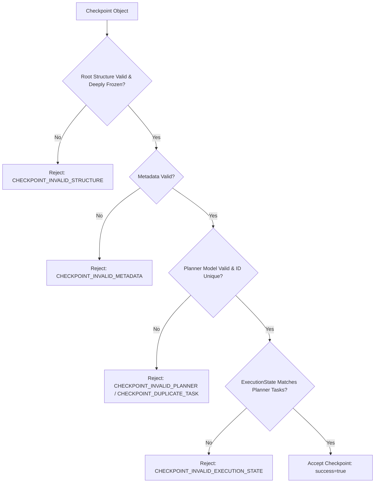

# Phase 5C — Checkpoint Validator

This document outlines the validation rules, verification steps, and error taxonomy for the Checkpoint Validator established in Task Pack 5C.

---

## 1. Executive Summary

*   **Objective**: Build a structural and semantic validator for execution checkpoint models.
*   **Result**: Created `backend/core/checkpoints/checkpointValidator.js` and exposed `validateCheckpoint` in `index.js`.
*   **Safety**: Validates root shape, metadata parameters, planner consistency, unique stable/display task IDs, status correctness, and execution list coverage.
*   **Tests**: Added **7 new unit tests** in `run_tests.js` verifying valid checkpoint validation, invalid structure rejections, invalid metadata values, duplicate task IDs, non-frozen configuration rejections, validation determinism, and parameters non-mutation.
*   **Status**: Regression baseline at **405 assertions passing**.

---

## 2. Validation Flow

The validator performs the following assertions:

---

## 3. Detailed Validation Responsibilities

1. **Structural Checks**:
   - Checkpoint must be a non-null object.
   - The entire object graph must be deeply frozen.
   - Required fields (`version`, `metadata`, `planner`, `executionState`) must exist.
2. **Metadata Checks**:
   - Fields (`checkpointVersion`, `plannerVersion`, `graphVersion`, `identityVersion`, `createdBy`) must be non-empty strings.
3. **Planner Checks**:
   - `planner` must contain valid `version`, `metadata`, and a `tasks` array.
   - Each task must have a unique `stableId` and `displayId`.
   - Dependency reference paths must point to valid stable IDs existing within the tasks set.
4. **ExecutionState Checks**:
   - Categories (`completedTasks`, `runningTasks`, `pendingTasks`, `failedTasks`) must be arrays.
   - The exact set of stable IDs listed in the lists must match the stable IDs in `planner.tasks` without duplicates or omissions.
   - Status values of tasks (e.g. `"COMPLETED"`, `"RUNNING"`, `"FAILED"`, `"PENDING"`) must match their corresponding lists.

---

## 4. Error Taxonomy

*   `CHECKPOINT_INVALID_STRUCTURE`: Missing top-level fields or non-frozen object graph.
*   `CHECKPOINT_INVALID_METADATA`: Missing or invalid metadata string parameters.
*   `CHECKPOINT_INVALID_PLANNER`: Invalid planner config, malformed tasks, or broken dependency linkages.
*   `CHECKPOINT_INVALID_EXECUTION_STATE`: Tasks count mismatch, duplicate entries, or status-to-list category discrepancies.
*   `CHECKPOINT_DUPLICATE_TASK`: Duplicate stableId or displayId keys found.
*   `CHECKPOINT_INTERNAL_ERROR`: General runtime exception wrapper.
