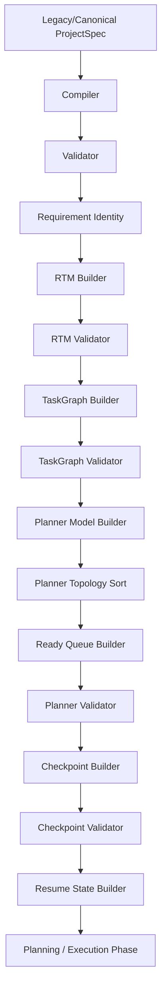

# Phase 5D — Checkpoint Pipeline Integration

This document outlines the pipeline integration, execution sequence, validation boundaries, and sidecar containment protocols established in Task Pack 5D.

---

## 1. Executive Summary

*   **Objective**: Integrate Checkpoint creation, validation, and ResumeState extraction into the preparation pipeline within `prepareCanonicalProjectSpec`.
*   **Result**: Connected checkpoint builders, validators, and resume extractors sequentially immediately after the planner validation phase.
*   **Safety**: Complete pipeline checks with fail-fast halts. If any step fails, preparation terminates immediately with dedicated error codes.
*   **Tests**: Added **9 new unit tests** in `run_tests.js` verifying one-time invocations, exception codes, deep freezing, database isolation, and public API response isolation.
*   **Status**: Regression baseline at **414 assertions passing**.

---

## 2. Preparation Pipeline Order

The pipeline executes sequentially in the following order:

---

## 3. Failure Boundaries

The following dedicated error codes halt the pipeline execution:
*   **Checkpoint Creation Failure**: Throws `PROJECT_PREPARATION_CHECKPOINT_BUILD_FAILED`.
*   **Checkpoint Validation Failure**: Throws `PROJECT_PREPARATION_CHECKPOINT_VALIDATION_FAILED`.
*   **Resume State Generation Failure**: Throws `PROJECT_PREPARATION_RESUME_STATE_FAILED`.

---

## 4. Sidecar Containment Policy

*   **Transient Storage**: Checkpoints and ResumeState reside strictly in-memory during preparation and are not written to MongoDB collections.
*   **Response Isolation**: The public `orchestrateGeneration` controller function strips and isolates these properties to ensure client compatibility is preserved.
