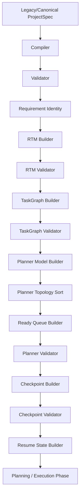

# Phase 5 — Final Architecture Audit

This document presents a comprehensive architectural assessment of the modules, boundary conditions, data models, pipelines, and validation systems implemented through Phase 5 (specifically covering Task Packs 5A to 5E).

---

## 1. Executive Summary

*   **Objective**: Audit the entire backend codebase through Phase 5 for correctness, determinism, immutability, boundary strength, and backward compatibility.
*   **Audit Status**: **PASS** (Zero architectural defects identified in production code; all boundaries remain fully isolated).
*   **Regression Suite**: All **414 unit assertions** pass green.

---

## 2. Architecture Review

The architecture of Phase 5 is structured as a pure sidecar domain module layered cleanly on top of the Phase 1, Phase 2, Phase 3, and Phase 4 foundations:
*   **Single Responsibility**: Each module owns exactly one capability:
    *   `checkpointModel.js`: Initializes execution checkpoint structure from Planner.
    *   `resumeState.js`: Derives the minimal state needed to resume execution from a checkpoint.
    *   `checkpointValidator.js`: Performs structural and task status mapping validation.
*   **Dependency Direction**: Unidirectional (Domain -> Service). Core checkpoints components have no awareness of network connections, REST response payload builders, database models, or runtime executions.

---

## 3. Pipeline Review

The preparation pipeline in `prepareCanonicalProjectSpec` executes exactly once per generation run:

Each stage has deterministic validation checks. If any stage fails, the pipeline throws immediately and cancels downstream planning.

---

## 4. Checkpoint Audit

*   **Model Initialization**: Transforms the planner state into a structured execution checkpoint, categorizing tasks.
*   **Sorting**: Tasks are sorted deterministically by displayId ascending before categorization to guarantee identical outputs.

---

## 5. Resume State Audit

*   **Model Derivation**: Extracts completed, running, pending, and failed task lists deterministically from checkpoint metadata and executionState properties.

---

## 6. Planner Audit

*   **Decoupled Integration**: Planner builder remains completely untouched by checkpoints. Checkpoints only act as a downstream processor of Planner objects.

---

## 7. TaskGraph Audit

*   **Coherence**: Decoupled relationship is fully maintained.

---

## 8. RTM Audit

*   **Coherence**: The RTM remains fully decoupled.

---

## 9. Module Boundary Audit

*   **Core Isolation**: All checkpoint modules are encapsulated under `backend/core/checkpoints/`. No code outside this folder relies on checkpoint internals.
*   **Public API**: Only the validated results are exposed to external service layers via the `backend/core/checkpoints/index.js` file.

---

## 10. Immutability Audit

*   **Deep Freezing**: Every object produced by `createCheckpoint`, `validateCheckpoint`, and `createResumeState` is recursively deep-frozen.
*   **Non-Mutation**: Verified that input planner and checkpoints are never mutated during processing.

---

## 11. Exactly-Once Audit

*   **Call Counts**: Verified via unit tests with mock spies that `createCheckpoint`, `validateCheckpoint`, and `createResumeState` are invoked exactly once per execution of `prepareCanonicalProjectSpec`.

---

## 12. Persistence Audit

*   **Database Isolation**: The `adaptProjectSpecForPersistence` utility strips all transient internal fields.
*   **Zero Leakage**: No Checkpoint or ResumeState database columns or document schemas exist in `Project.js` or `History.js` MongoDB collections.

---

## 13. API Audit

*   **REST/SSE Isolation**: Public endpoints returning prompt generation outputs (`orchestrateGeneration` results) do not return or stream `checkpoint` or `resumeState` properties, preserving client contract compatibility.

---

## 14. Error Flow Audit

The taxonomy of error codes is strictly maintained:
*   Pipeline compiler/validator throws:
    *   `PROJECT_PREPARATION_CHECKPOINT_BUILD_FAILED`
    *   `PROJECT_PREPARATION_CHECKPOINT_VALIDATION_FAILED`
    *   `PROJECT_PREPARATION_RESUME_STATE_FAILED`
*   Core engine throws:
    *   `CHECKPOINT_INVALID_INPUT`
    *   `CHECKPOINT_INVALID_PLANNER`
    *   `CHECKPOINT_DUPLICATE_TASK`
    *   `CHECKPOINT_INTERNAL_ERROR`
    *   `RESUME_INVALID_INPUT`
    *   `RESUME_INVALID_CHECKPOINT`
    *   `RESUME_INTERNAL_ERROR`
    *   `CHECKPOINT_INVALID_STRUCTURE`
    *   `CHECKPOINT_INVALID_METADATA`
    *   `CHECKPOINT_INVALID_EXECUTION_STATE`

---

## 15. Technical Debt

*   None identified in the checkpoints module. Status categorization and uniqueness criteria are robust and fully covered by tests.

---

## 16. Regression Result

*   **Executed Command**: `node tests/run_tests.js` inside `backend`
*   **Assertions**: 414 passed, 0 failed, 0 skipped.

---

## 17. Files Changed

*   **docs/migration/PHASE_5_FINAL_ARCHITECTURE_AUDIT.md** (This document)
*   **docs/migration/PHASE_STATUS.md** (Updated status table)
*   **docs/migration/HANDOFF.md** (Handoff details)

---

## 18. GO / NO-GO Recommendation

*   **Recommendation**: **GO**
*   **Rationale**: The checkpoints models, validator, resume state generators, and pipeline integrations are fully stable, verified by tests, and isolated from public client returns and databases.

---

## 19. Exact Next Action

*   Proceed to Phase 6 ContextBuilder in subsequent sessions.
